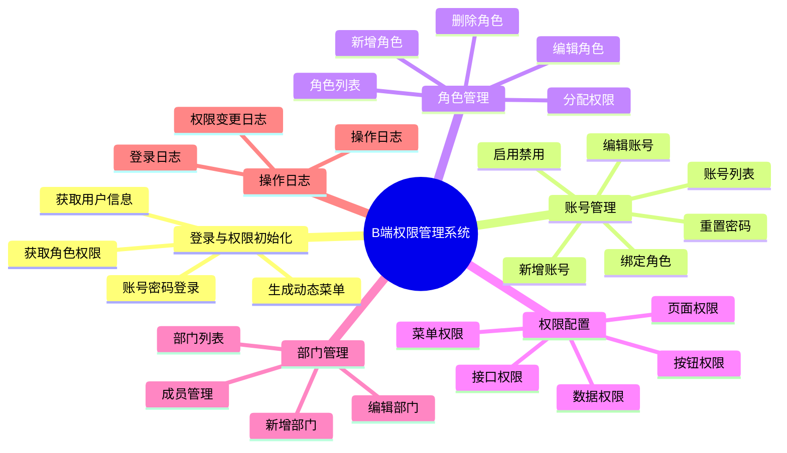
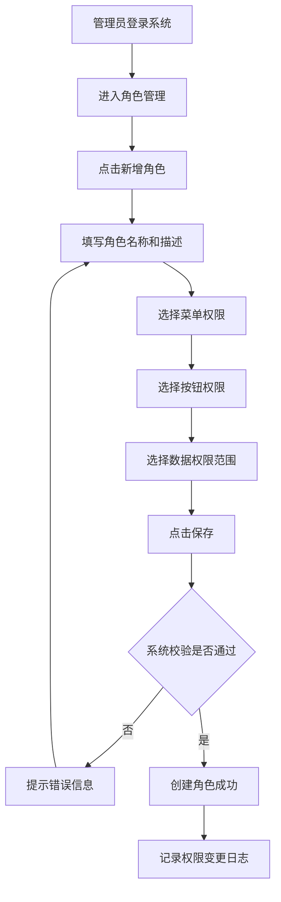
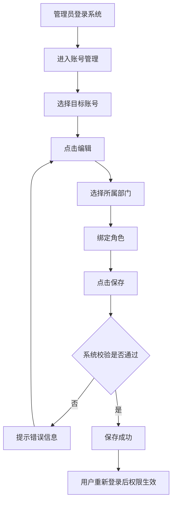
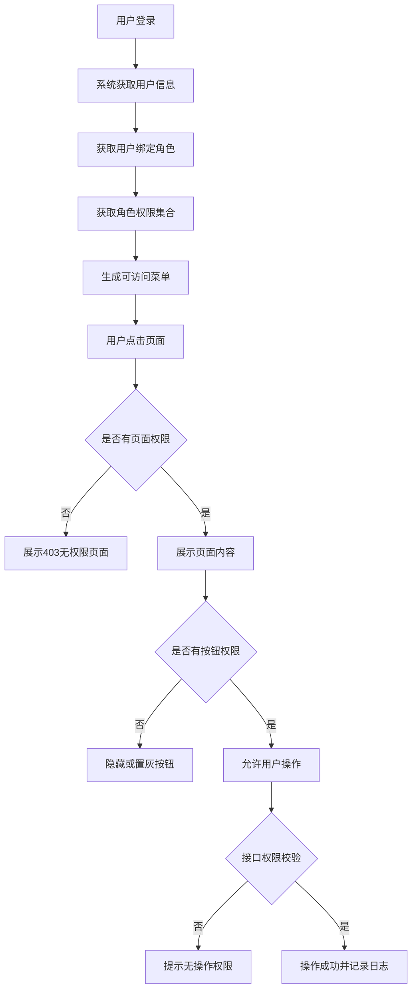

# B端权限管理系统产品方案 PRD

## 1. 文档信息

| 项目 | 内容 |
| --- | --- |
| 产品名称 | B端权限管理系统 |
| 产品类型 | 企业后台基础能力 / 权限配置系统 |
| 适用场景 | SaaS后台、中后台管理系统、运营管理平台 |
| 目标用户 | 超级管理员、业务管理员、普通员工 |
| 文档版本 | V1.0 |
| 作者 | 莫淑杰 |

## 2. 产品背景

在企业后台系统中，不同岗位用户需要访问不同菜单、页面、按钮、接口和业务数据。例如运营人员只能查看业务数据，财务人员只能查看结算数据，管理员需要管理账号、角色和权限。如果缺少统一权限管理，容易出现权限配置混乱、越权访问、账号维护成本高、权限变更不可追溯等问题。

本方案基于常见B端后台权限管理场景，设计一套通用权限管理系统，支持账号管理、角色管理、菜单权限、按钮权限、数据权限和操作日志，帮助企业提升权限配置效率和系统安全性。

## 3. 需求目标

1. 支持管理员统一管理企业后台账号，包括新增、编辑、启用、禁用、重置密码和绑定角色。
2. 支持通过角色进行权限分组管理，降低逐个账号配置权限的成本。
3. 支持菜单、按钮、接口和数据范围等多维度权限配置。
4. 支持权限变更记录，便于后续审计和问题追踪。
5. 支持用户登录后根据权限展示对应菜单和操作入口，避免越权访问。

## 4. 目标用户

| 用户角色 | 主要诉求 | 典型操作 |
| --- | --- | --- |
| 超级管理员 | 管理系统全部账号、角色和权限 | 创建账号、创建角色、分配权限、查看日志 |
| 业务管理员 | 管理本部门或指定范围内账号 | 编辑账号、绑定角色、查看业务数据 |
| 普通员工 | 使用被授权的业务功能 | 查看菜单、使用页面、提交业务操作 |

## 5. 功能范围

### 5.1 本期包含

1. 登录与权限初始化
2. 账号管理
3. 角色管理
4. 权限配置
5. 部门管理
6. 操作日志
7. 无权限提示

### 5.2 本期不包含

1. 单点登录
2. 多租户权限隔离
3. 复杂审批流
4. 第三方组织架构同步

## 6. 功能结构图

## 7. 核心业务流程

### 7.1 创建角色并分配权限流程

### 7.2 给用户绑定角色流程

### 7.3 用户访问权限判断流程

## 8. 页面清单

| 页面 | 说明 | 主要功能 |
| --- | --- | --- |
| 登录页 | 用户进入系统入口 | 登录、错误提示 |
| 首页 | 登录后默认页面 | 展示账号信息、快捷入口 |
| 账号管理 | 管理后台用户账号 | 查询、新增、编辑、禁用、重置密码、绑定角色 |
| 角色管理 | 管理权限分组 | 查询、新增、编辑、删除、分配权限 |
| 权限配置 | 为角色配置权限 | 菜单权限、按钮权限、数据权限 |
| 部门管理 | 管理组织部门 | 新增、编辑、删除、成员管理 |
| 操作日志 | 查看操作记录 | 查询、筛选、查看详情 |
| 403页面 | 无权限提示 | 返回首页 |

## 9. 页面原型说明

### 9.1 账号管理页

筛选项：

| 字段 | 类型 | 说明 |
| --- | --- | --- |
| 账号名称 | 输入框 | 支持模糊搜索 |
| 手机号 | 输入框 | 支持精确搜索 |
| 所属部门 | 下拉选择 | 默认全部 |
| 账号状态 | 下拉选择 | 全部、启用、禁用 |
| 创建时间 | 日期范围 | 支持按创建时间筛选 |

列表字段：

| 字段 | 说明 |
| --- | --- |
| 账号名称 | 登录账号 |
| 姓名 | 用户真实姓名 |
| 手机号 | 用户手机号 |
| 所属部门 | 当前用户所属部门 |
| 绑定角色 | 当前账号绑定角色 |
| 状态 | 启用/禁用 |
| 最近登录时间 | 最近一次登录时间 |
| 创建时间 | 账号创建时间 |
| 操作 | 编辑、禁用/启用、重置密码 |

交互规则：

1. 点击“新增账号”打开新增账号弹窗。
2. 点击“编辑”打开编辑账号弹窗，回显账号基础信息和已绑定角色。
3. 禁用账号后，该账号不可登录系统。
4. 重置密码需要二次确认。
5. 手机号格式不正确时，保存失败并提示。

### 9.2 角色管理页

筛选项：

| 字段 | 类型 | 说明 |
| --- | --- | --- |
| 角色名称 | 输入框 | 支持模糊搜索 |
| 角色状态 | 下拉选择 | 全部、启用、禁用 |
| 创建时间 | 日期范围 | 按创建时间筛选 |

列表字段：

| 字段 | 说明 |
| --- | --- |
| 角色名称 | 权限分组名称 |
| 角色描述 | 角色用途说明 |
| 关联账号数 | 当前角色绑定账号数量 |
| 状态 | 启用/禁用 |
| 创建人 | 创建该角色的管理员 |
| 创建时间 | 创建时间 |
| 操作 | 编辑、分配权限、删除 |

交互规则：

1. 角色名称必填，且不可重复。
2. 删除角色前需要二次确认。
3. 已绑定账号的角色不允许删除，需要先解绑账号。
4. 禁用角色后，已绑定用户无法继续使用该角色权限。

### 9.3 分配权限页

页面区域：

| 区域 | 内容 |
| --- | --- |
| 角色基础信息 | 角色名称、角色描述、角色状态 |
| 菜单权限 | 树形结构展示一级、二级、三级菜单 |
| 按钮权限 | 按页面展示新增、编辑、删除、导出等按钮权限 |
| 数据权限 | 全部数据、本部门数据、本人数据、自定义部门 |
| 操作区 | 保存、取消 |

交互规则：

1. 勾选父级菜单时，默认勾选子级菜单。
2. 取消父级菜单时，默认取消子级菜单。
3. 勾选按钮权限前，需要先勾选对应页面权限。
4. 数据权限选择“自定义部门”时，需要展示部门选择树。
5. 保存后记录权限变更日志。

## 10. 异常状态

| 场景 | 系统处理 |
| --- | --- |
| 角色名称为空 | 提示“请输入角色名称” |
| 角色名称重复 | 提示“角色名称已存在” |
| 未选择任何权限 | 提示“请至少选择一个权限” |
| 删除已绑定账号的角色 | 提示“该角色已绑定账号，请先解绑后再删除” |
| 禁用账号后用户登录 | 提示“账号已被禁用，请联系管理员” |
| 用户无页面权限 | 展示403无权限页面 |
| 用户无按钮权限 | 不展示按钮或按钮置灰 |
| 接口权限校验失败 | 提示“无操作权限” |
| 保存时网络异常 | 提示“保存失败，请稍后重试” |

## 11. 验收标准

1. 管理员可以成功新增、编辑、启用、禁用账号。
2. 管理员可以成功创建角色，并为角色配置菜单、按钮和数据权限。
3. 账号绑定角色后，用户重新登录可以看到对应权限范围内的菜单。
4. 无页面权限用户访问页面时，系统展示403无权限提示。
5. 无按钮权限用户不展示对应操作按钮，或按钮置灰不可点击。
6. 已绑定账号的角色不可直接删除。
7. 权限配置变更后，系统记录操作人、操作时间和变更内容。
8. 筛选、分页、重置等基础操作符合后台系统常规交互。

## 12. 面试讲解思路

这个项目是基于我过往多个中后台权限模块开发经验做的产品练习。我从B端后台最常见的“用户、角色、资源、权限”模型出发，设计了账号管理、角色管理、权限配置、部门管理和操作日志几个模块。

在方案设计上，我先梳理目标用户和核心场景，再画功能结构图和流程图，最后整理页面字段、交互规则、异常状态和验收标准。因为我有前端开发背景，所以在写PRD时会特别关注字段规则、权限边界、页面状态、接口校验和研发落地成本，这也是我从开发转产品的优势。

