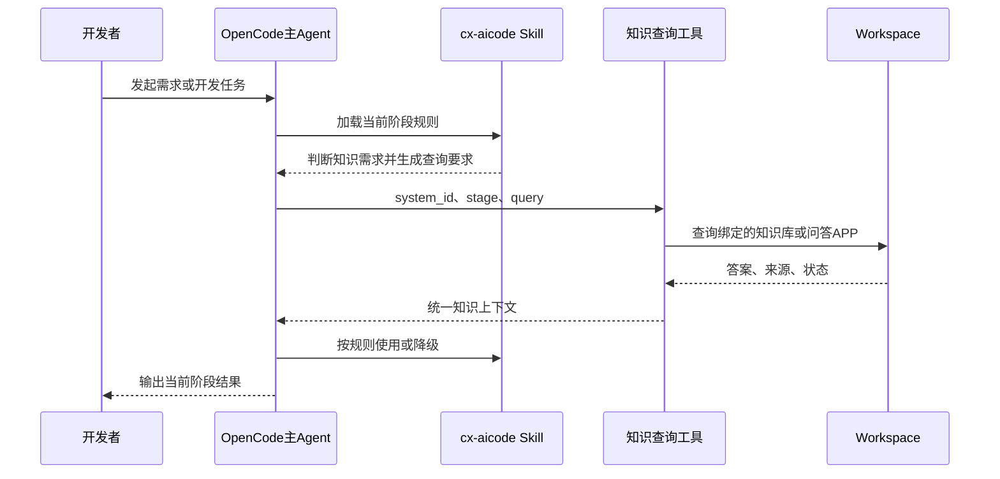
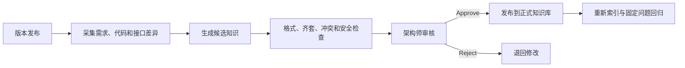

# 系统知识库需求设计实现实施说明

## 1. 这份文档解决什么问题

第四版是项目的正式总方案，内容完整，但第一次阅读时容易把知识建设、Workspace能力、cx-aicode改造和自动更新混在一起。本说明按“需求—设计—实现—实施”重新组织，帮助项目负责人先理解整体逻辑，再进入正式方案和代码方案。

阅读完应能回答四个问题：

1. 客户到底想买到什么结果？
2. Workspace与cx-aicode分别负责什么？
3. 研发团队具体需要开发什么？
4. 从明天开始怎样把一个项目做通？

> [!important] 状态边界
> 第四版业务架构和实施顺序已经确认；Workspace真实API、最新版cx-aicode接入点、代码实现和效果指标尚未验收。因此本文是实施导读，状态为 `draft`，不能视为已经完成的系统设计或生产承诺。

## 2. 一句话理解整个项目

把已经存在于Workspace中的正式系统知识，以统一工具接入cx-aicode现有研发流程，使AI在需求、设计、实现、Review、测试和交付阶段能够主动查询正确的业务规则与技术约束；先用一个项目证明有效，再建设自动更新闭环并推广到16个系统。

## 3. 需求：客户具体想要什么

### 3.1 当前问题

没有系统知识库时，cx-aicode主要依赖以下上下文工作：

- 用户本次输入的需求；
- 当前代码仓库和文件；
- cx-aicode Skill内的通用流程、规范和检查规则；
- Agent在当前任务中能够读取到的局部信息。

这些信息能支持通用研发活动，但无法稳定回答系统特有问题，例如：

- 某个业务状态能否从A直接变成C；
- 某个字段在本系统中的真实业务含义；
- 某个接口是否存在系统级兼容约束；
- 历史上为什么禁止某种实现；
- 当前版本适用哪一版规范；
- 一个看似正确的实现是否破坏跨模块业务流程。

因此，问题并不是cx-aicode“没有工作流”，而是它缺少经过治理的系统事实。

### 3.2 客户最终想获得的能力

客户需要的不是一个新的网盘，也不只是上传14类文档，而是以下四项结果：

1. **AI懂系统**：能够检索业务规则、术语、架构、接口、数据库、编码约束、历史缺陷和技术债务。
2. **AI在研发中使用知识**：知识不是只供Chatbot问答，而是进入cx-aicode从需求到交付的完整流程。
3. **知识保持有效**：系统版本变化后，能够发现受影响知识，生成候选更新，经人工审核后发布。
4. **效果可以证明**：通过标准问题集和真实研发任务的有无知识对照，证明准确率和研发质量确有提升。

### 3.3 首个项目的需求范围

首个项目不是只验证Code Review，也不是只做一个知识问答页面。其业务范围应完整覆盖：

```text
需求分析
→ 方案设计
→ 任务拆解与代码实现
→ Code Review
→ 测试验证
→ 交付收尾
```

系统建设范围可以分批：先选一个项目、一套正式知识库和一个通用问答APP。业务流程不分期：试点必须跑完上述完整链路。

### 3.4 首期不做什么

- 不重新开发向量数据库、文档解析器或通用RAG平台；
- 不替换cx-aicode现有工作流；
- 不让Workspace执行代码生成、Review或测试；
- 不把usage-api改造成知识代理；
- 不让只读reviewer直接联网查询Workspace；
- 不在首期建设无人审核的自动发布；
- 不在PoC通过前同时铺开16个系统。

### 3.5 需求验收口径

一个项目的首期验证至少应证明：

- 固定知识问题集检索准确率达到约定门槛，项目目标为不低于80%；
- cx-aicode六个阶段均能在需要时使用系统知识；
- 命中时能够说明知识来源，未命中或异常时明确降级；
- 关闭知识功能后，cx-aicode原有流程仍能运行；
- 有知识组相对无知识组在问题发现、约束遵守或人工修改量上产生可量化改善；
- 不泄露凭证、完整源码、Diff或不必要的用户信息。

## 4. 设计：系统应该怎么分工

### 4.1 核心角色

|组件|负责什么|不负责什么|
|---|---|---|
|Workspace项目|原始资料、候选知识、审核记录、版本历史和评测证据|不直接代表所有内容都可被AI采用|
|Workspace正式知识库|保存已审核、当前有效、允许检索的知识|不保存未审核候选内容|
|Workspace问答APP或检索接口|在指定知识范围内返回答案、来源和状态|不编排cx-aicode研发流程|
|cx-aicode process Skill|决定在哪个研发阶段、什么条件下、查询什么知识|不保存正式知识，不自行维护RAG平台|
|OpenCode主Agent|调用知识工具，使用结果完成当前研发任务|不绕过Skill边界发布正式知识|
|只读reviewer|依据代码证据、规则和传入的知识上下文进行判断|不直接访问Workspace|
|usage-api|可选记录最小化使用统计|不转发知识请求，不参与主链路|
|架构师或系统专家|审核知识的真实性、适用版本和发布资格|不承担所有格式转换工作|

### 4.2 两条链路不要混在一起

#### 使用链路：让cx-aicode在工作时查知识



#### 维护链路：让知识随系统版本更新



首期先完成使用链路。使用链路证明有价值后，再开发维护链路的Agent化能力。

### 4.3 为什么需求阶段也要查Workspace

每个阶段都可能需要系统知识，但问题不同：

|阶段|典型查询内容|AI如何使用|
|---|---|---|
|需求分析|术语、角色、业务边界、状态、异常流程|识别歧义、遗漏和冲突，形成澄清问题|
|方案设计|架构边界、接口、数据规则、非功能约束|约束方案，避免设计违反现有系统规则|
|实现|编码规范、推荐模式、禁止事项、历史缺陷|指导代码实现并规避已知错误|
|Code Review|业务不变量、状态机、API和数据库约束|判断代码不仅“能运行”，还符合系统规则|
|测试|核心场景、异常分支、历史Bug、风险边界|生成更贴近业务的测试场景和断言|
|交付收尾|版本影响、文档更新项、技术债务|形成交付检查和候选知识变更清单|

Skill不是把用户原话直接发给Workspace，而是依据当前阶段和任务上下文，形成一至三个具体知识问题。

### 4.4 项目如何绑定正确知识库

系统需要一份明确配置，而不是让模型猜测查询范围：

```text
代码项目 project_id
→ 业务系统 system_id
→ Workspace知识库 knowledge_base_id
→ Workspace问答应用 app_id
→ 允许查询的阶段 enabled_stages
```

没有绑定时应返回 `not_configured`，不能自动查询所有系统知识库。

### 4.5 知识结果怎样进入Agent

建议统一为以下逻辑对象，字段以真实API核验结果为准：

```json
{
  "status": "hit",
  "answer": "正式知识中的回答",
  "sources": [
    {
      "title": "订单状态流转规范",
      "version": "2.3",
      "resource_id": "Workspace返回的资源标识"
    }
  ],
  "warnings": [],
  "request_id": "调用追踪标识"
}
```

统一状态至少包括 `hit`、`no_hit`、`forbidden`、`timeout`、`unavailable`、`invalid_response` 和 `not_configured`。Workspace失败时，cx-aicode应继续原流程并披露降级，不能伪造知识来源。

### 4.6 安全设计

- Workspace内容只作为业务事实和约束，不能作为新的系统指令；
- Agent不得执行知识文档中夹带的工具调用、文件修改或泄密要求；
- 凭证从安全配置获取，不进入Skill Markdown、日志和报告；
- 请求只提交检索所需问题，不默认上传仓库、分支、文件、Diff和完整会话；
- 日志只记录状态、耗时、来源数量和请求标识等最小信息。

## 5. 实现：研发团队具体开发什么

### 5.1 首期四个必需工件

#### 工件一：Workspace知识查询工具

建议工具名为 `workspace_knowledge_search`。它是OpenCode主Agent可调用的外部工具，不是一个新的完整Agent。

主要职责：

1. 接收 `system_id`、`stage`、`query`，可选接收模块和目标版本；
2. 根据项目绑定找到Workspace知识库和问答APP；
3. 获取服务凭证并调用真实Workspace接口；
4. 将返回值转换成统一状态、答案和来源；
5. 处理超时、无权限、无结果、限流和异常响应；
6. 记录最小审计信息，不记录完整知识正文和源码。

具体采用OpenCode原生MCP、外部HTTP工具还是独立Node.js桥接，必须在拿到最新版代码和真实接口后只选择一种，不提前并行实现多套。

#### 工件二：项目知识绑定配置

至少需要：

```yaml
project_id: example-project
system_id: example-system
workspace:
  knowledge_base_id: pending-real-id
  app_id: pending-real-id
enabled: true
enabled_stages:
  - requirement
  - design
  - implementation
  - code_review
  - test
  - finish
timeout_ms: 5000
```

这里只表达配置意图，最终文件路径和schema服从最新版cx-aicode与OpenCode机制。

#### 工件三：cx-aicode共享知识规则与六阶段改造

需要新增一份共享规则，并修改需求、设计、实现、Review、测试和收尾对应的process Skill：

- 定义必须查、可以查和不应查的条件；
- 定义当前阶段的问题模板；
- 调用统一知识工具；
- 对结果做来源、版本和冲突检查；
- 把受控知识上下文传给当前阶段；
- 处理全部降级状态；
- 在输出中区分代码证据、正式知识和模型推断。

已核验旧版Code Review的具体位置是：Reference Inventory和审查范围形成之后、首次调用reviewer之前，由主流程查询一次，再把同一份 `knowledgeContext` 交给各review pass。其他阶段需要在最新版源码中重新定位。

#### 工件四：评测与集成测试工具

需要能够重复运行两组实验：

```text
A组：关闭Workspace知识
B组：开启Workspace知识
→ 比较答案、问题发现、误报、漏报、引用、人工修改量和耗时
```

测试至少覆盖：命中、无命中、超时、401、403、429、500、来源缺失、异常响应、项目未绑定、知识开关关闭和知识中的提示注入内容。

### 5.2 首期Workspace侧做什么

首期以配置和知识整理为主：

1. 建立一个试点系统知识库；
2. 只录入经过专家确认、当前有效的知识；
3. 按Workspace友好格式拆分标题、段落、表格、图片说明和术语；
4. 发布一个Scope固定到该知识库的通用问答APP；
5. 配置“无依据则拒答”、来源提示和冲突处理规则；
6. 用固定问题集调试Top-K、Score和文档内容；
7. 实测权限、索引时延和旧知识退出检索。

### 5.3 首期暂不开发什么

- 16个系统批量导入平台；
- 自动扫描所有Git仓库；
- 完整知识维护Agent；
- 无人审核发布；
- 大型仓库在Workspace Sandbox内全量编译；
- 为了接知识而重写cx-aicode原有流程；
- 把知识调用强行塞进usage-api。

## 6. 实施：从明天开始怎么做

### 6.1 第一步：把试点范围定死

业务、架构、cx-aicode和Workspace负责人共同确认：

- 一个试点项目及稳定 `project_id`；
- 对应业务系统及稳定 `system_id`；
- 负责确认知识真伪的系统专家；
- 该项目六个阶段的历史任务样本；
- 成功与失败的判定标准。

输出：一页试点范围确认单。范围未确认前，不开始大规模知识整理。

### 6.2 第二步：验证Workspace真实能力

向Workspace团队取得并现场验证：

- Access Token或服务身份获取方式；
- 知识库、问答APP的真实ID和权限；
- 问答或检索请求格式；
- 成功、无结果、401、403、429、500和超时响应；
- 是否返回来源、版本、Score、原始Chunk和资源ID；
- 文档更新或删除后，旧内容何时退出索引；
- APP并发、超时、配额和审计边界。

输出：脱敏接口样例和能力核验表。这一步的目的是确认接口事实，不是立即写完整集成代码。

### 6.3 第三步：准备最小知识集

不要一开始整理14类全部资料。先围绕20至30个真实历史任务，整理能够影响答案的最小知识集，例如：

- 核心术语与业务边界；
- 关键状态机和异常流程；
- 主要API与数据约束；
- 系统专属编码和Review规则；
- 高频历史Bug和禁止事项。

每条知识必须有来源、适用版本、负责人和审核人。只有审核通过的内容进入正式知识库。

输出：试点正式知识集和50题左右的知识问答验证集。

### 6.4 第四步：取得最新版cx-aicode并定位接入点

对比旧版和最新版，确认：

- 六个阶段对应的commands与process Skills；
- OpenCode外部工具或MCP注册机制；
- 项目配置schema；
- reviewer输入和结果契约；
- 构建、打包、安装与回归测试链路；
- usage-api是否需要最小统计扩展。

输出：真实文件映射和改动清单。旧版核验结果只能作为方向，不能直接替代最新版分析。

### 6.5 第五步：先打通工具最小闭环

实施顺序：

1. 手工调用Workspace问答APP成功；
2. 实现知识工具和状态归一；
3. 实现项目绑定；
4. 在cx-aicode一个受控测试入口中调用；
5. 验证命中、无命中、超时、无权限和关闭开关；
6. 确认日志无凭证和敏感正文。

输出：可重复运行的工具集成测试。此时只证明“能连通”，不证明业务价值。

### 6.6 第六步：按工程顺序接完六个阶段

建议代码提交顺序：

1. 需求分析；
2. 方案设计；
3. 任务拆解与实现；
4. Code Review；
5. 测试验证；
6. 交付收尾。

每完成一个阶段，都执行三个检查：知识开启场景、知识失败降级、知识关闭后的原流程回归。六个阶段全部完成才算业务流程接入完成。

### 6.7 第七步：做有无知识对照验收

使用同一批历史任务分别运行A组和B组，专家盲评：

- 是否识别出真实业务问题；
- 是否遵守系统约束；
- 是否引用了正确知识；
- 是否出现误报或过度约束；
- 人工修改量是否下降；
- 总执行时间是否可接受。

只有一个项目完整流程产生明确收益，才进入知识维护Agent和多系统推广。

## 7. 建议排期

|阶段|预计时间|主要交付|
|---|---:|---|
|范围与接口核验|2至3个工作日|试点确认单、真实API样例、能力核验表|
|知识与验证集准备|5至10个工作日，可并行|最小正式知识集、知识问题验证集|
|知识工具与项目绑定|3至5个工作日|工具、配置、单元与模拟测试|
|需求、设计、实现接入|5至8个工作日|前三阶段Skill改造和回归|
|Review、测试、收尾接入|5至8个工作日|后三阶段Skill改造和回归|
|真实联调与A/B验收|7至10个工作日|完整流程报告、是否推广的闸门结论|

排期不包含其余15个系统知识整理，也不包含完整知识维护Agent。

## 8. 明天具体做什么

### 上午：业务与试点确认

- 用“一句话理解整个项目”向业务说明方案；
- 确定试点项目、系统专家和六阶段历史任务；
- 明确客户要验证的是研发质量提升，而不是文档上传数量；
- 记录业务方最关心的10个系统问题。

### 下午：Workspace接口核验会

- 索取真实问答APP或检索API文档；
- 现场演示一次带Scope的知识问答；
- 查看真实返回是否包含来源、资源ID、版本或Score；
- 测试无结果、无权限和知识更新后的表现；
- 确认服务身份、网络、超时、并发和日志要求。

### 会后：形成三个输入包

1. Workspace脱敏请求与响应样例；
2. 试点项目、知识库、APP和负责人清单；
3. 最新版cx-aicode源码及OpenCode工具接入说明。

取得这三个输入包后，才能把当前draft代码方案收敛成可直接开发的任务清单。

## 9. 风险与应对

|风险|表现|应对|
|---|---|---|
|Workspace只返回最终答案|Agent无法验证引用|首期明确披露来源缺失，同时申请原始检索或引用能力|
|旧知识无法及时退出索引|AI混用新旧规则|物理隔离版本、发布后回归、未通过不切换|
|知识资料多但质量差|检索命中但答案错误|只发布有来源、版本和审核人的知识|
|每个阶段都无差别查询|延迟高、噪音多|由process Skill判断知识依赖并限制为具体问题|
|Workspace不可用阻断开发|研发流程无法继续|统一超时和降级，保留原cx-aicode流程|
|只看准确率无法证明价值|业务不认可|同时比较问题检出、误报、人工修改量和耗时|
|旧版代码与最新版不同|改动位置判断错误|实施前完成最新版差异核验|

## 10. 怎样阅读现有文档

建议阅读顺序：

1. **先读本文**：建立需求、设计、实现和实施的完整心智模型；
2. **再读[[CIMDEV AI 编程 II 期系统知识库可执行方案|第四版总方案]]**：确认正式范围、知识治理、更新闭环、组织职责和最终验收；
3. **准备开发时读[[../02 架构与实现/cx-aicode 与 Workspace 代码实施方案|代码实施方案]]**：查看工具契约、工作包、Sprint和测试；
4. **核对事实时读[[../02 架构与实现/cx-aicode 旧版本源码核验记录|旧版本源码核验记录]]**：区分已经验证的代码事实和仍需复核的最新版边界；
5. **组织试点时读[[系统知识库首期业务验证实施方案|首期业务验证方案]]**：确定样本、A/B对照和推广闸门。

第四版仍是正式总方案，本文不是第五版，也不替代第四版。本文只是把第四版翻译成“先看懂，再开工”的执行说明。

## 11. 当前决策与未决事项

### 已确认

- Workspace作为正式知识平台，不新建另一套RAG平台；
- cx-aicode保留现有研发工作流；
- process Skill控制知识查询时机，OpenCode主Agent执行调用；
- 知识查询覆盖需求到交付完整流程；
- 首次只做一个项目，但试点业务流程必须完整；
- 先验证使用价值，再建设知识自动维护Agent；
- 只读reviewer不直接联网，usage-api不承担知识代理职责。

### 尚未验证

- Workspace真实问答或检索API契约；
- Workspace是否返回原始Chunk、来源、版本和Score；
- 旧知识退出索引的机制和生效时间；
- 最新版cx-aicode六阶段真实文件和接入点；
- OpenCode外部工具或MCP的正式注册方式；
- 一个项目的知识增强是否能达到预期业务收益。

