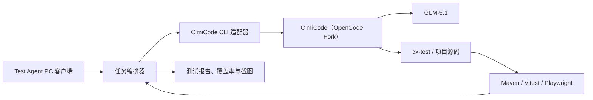

# 测试 Agent 与 CimiCode 对接方案

> [!summary] 核心结论
> 首期采用本机进程适配：Test Agent 负责任务输入、知识准备、状态编排和报告；CimiCode 作为公司 OpenCode Fork，负责调用 GLM-5.1、理解项目并复用 cx-test 等能力；Maven、Vitest、Playwright 等真实测试工具负责给出最终执行结果。Test Agent 不重新实现大模型运行框架，也不通过模拟鼠标操作 CimiCode 界面。

## 组件关系



职责边界：

| 组件 | 负责 | 不负责 |
|---|---|---|
| Test Agent | 任务入口、项目选择、Workspace 知识准备、测试分发、状态、制品和报告 | 不直接判断测试是否通过，不保存 GLM-5.1 密钥 |
| CimiCode | Agent/Skill 编排、模型调用、代码理解、测试规划和生成、失败分析 | 不替代真实编译器和测试框架 |
| cx-test | 可复用的测试生成与执行流程能力 | 不等于完整独立 Test Agent 产品 |
| 真实测试工具 | 编译、执行、断言、覆盖率和 UI 截图 | 不负责业务知识理解和跨类型调度 |

## 首期对接方式

最终用户电脑安装 Test Agent，并具备 CimiCode 和首期测试所需的 Java、Node.js、浏览器等环境。Test Agent 通过 Electron 主进程启动 CimiCode：

```ts
spawn(cimicodeExecutable, args, {
  cwd: projectPath,
  shell: false,
  stdio: ['pipe', 'pipe', 'pipe']
})
```

任务通过标准输入或经核验的任务文件传递，避免把界面输入直接拼接成 Shell 命令。当前初版已实现安全进程适配骨架，真实模式默认关闭。

建议任务上下文至少包含：

- 系统、版本、项目路径和变更范围；
- 需要执行的单元、回归、UI 测试类型；
- Workspace 返回的业务规则、历史缺陷和来源标识；
- 允许调用的 Skill、命令与测试工具；
- 制品目录、结构化输出协议、超时和自动修正次数。

## 推荐调用契约

下列是待 CimiCode 最新版核验的目标契约，不是当前已验证事实：

```powershell
cimicode run `
  --agent cx-test `
  --model glm-5.1 `
  --format jsonl `
  --project <项目目录>
```

CimiCode 团队需要明确：

| 契约项 | 核验内容 |
|---|---|
| 可执行入口 | `cimicode.exe`、脚本入口或其他正式路径 |
| 非交互模式 | 命令名、参数、stdin/任务文件支持 |
| 工作目录 | 是否以进程 `cwd` 为项目根目录 |
| 模型配置 | GLM-5.1 的配置来源和可选覆盖方式 |
| Skill/Agent | 如何指定 cx-test 或专用 Test Agent Skill |
| 输出协议 | JSON、JSONL、流式事件及编码 |
| 进程状态 | 退出码、错误码、超时、取消和恢复 |
| 安全权限 | 文件写入、命令执行、外部工具和网络访问边界 |

## 结构化事件

推荐 CimiCode 使用 JSONL 输出，Test Agent 按行解析并刷新界面：

```json
{"type":"phase","name":"code_analysis","status":"running"}
{"type":"artifact","name":"test-plan.json","path":".test-agent/test-plan.json"}
{"type":"test","suite":"OrderServiceTest","status":"passed"}
{"type":"coverage","line":82.4}
{"type":"completed","exitCode":0}
```

不建议依赖终端自然语言文本判断任务状态，否则版本升级、文案变化和中英文输出会导致解析不稳定。

## GLM-5.1 与 Workspace

GLM-5.1 继续由 CimiCode 管理，Test Agent 不重复保存模型凭据或建设模型客户端。

Workspace 首期推荐由 Test Agent 在调用 CimiCode 前查询一次：

```text
项目与变更扫描
→ Workspace知识查询
→ knowledge-ref.json
→ 将受控知识上下文交给CimiCode
→ 生成并执行测试
→ 报告记录知识来源
```

待工具注册和权限模型核验后，可再评估让 CimiCode 在执行过程中自主查询 Workspace。

## 部署演进与当前冲突

现有 accepted 决策记录的是“测试服务在服务器上调用 CimiCode CLI”；后续 PC 初版和用户当前沟通采用“最终用户安装 EXE、本机调用 CimiCode”。两者可以形成分阶段架构，但服务端是否仍为最终生产形态尚未重新决策：

1. **首期 PC PoC**：本机 Test Agent + 本机 CimiCode，快速验证 Java/Vue 真实闭环；
2. **后续集中执行**：PC 端通过 API/WebSocket 连接 CimiCode Runner Service，实现定时、批量、并发和 16 系统统一环境。

在新决策确认前，不能把 PC 本机模式自动视为已经替代服务端方案。

## 安全要求

- CimiCode 可执行路径和固定参数由管理员配置，不允许普通界面任意输入；
- 使用参数数组与 `shell: false`，不拼接 Shell 命令；
- 每个任务限定项目根目录、制品目录、超时、并发和进程取消；
- 模型凭据、Workspace 认证和内部地址不得写入报告或日志；
- GLM-5.1 生成结果必须经真实测试工具验证，不能以模型输出作为通过依据；
- 接入前覆盖正常执行、非法路径、超时、取消、非零退出码、畸形事件和进程残留测试。

## 下一步输入

要把当前模拟适配器改成真实调用，需要取得：

1. CimiCode 最新版本与安装位置；
2. `cimicode --help` 或等价帮助输出；
3. 一个可非交互执行的成功示例；
4. GLM-5.1 的配置方式；
5. cx-test 的正式调用入口；
6. 结构化输出、退出码、超时和取消约定；
7. 一个可编译、允许生成测试的 Java + Vue 试点项目。

## 关联笔记

- [[书架/06 项目/CIMDEV AI 编程 II 期/01 需求与决策/测试 Agent 技术基座与分阶段覆盖决策]]
- [[书架/06 项目/CIMDEV AI 编程 II 期/02 架构与实现/测试 Agent 技术方案]]
- [[书架/06 项目/CIMDEV AI 编程 II 期/03 实施与验收/测试 Agent PC 初版实施记录]]

