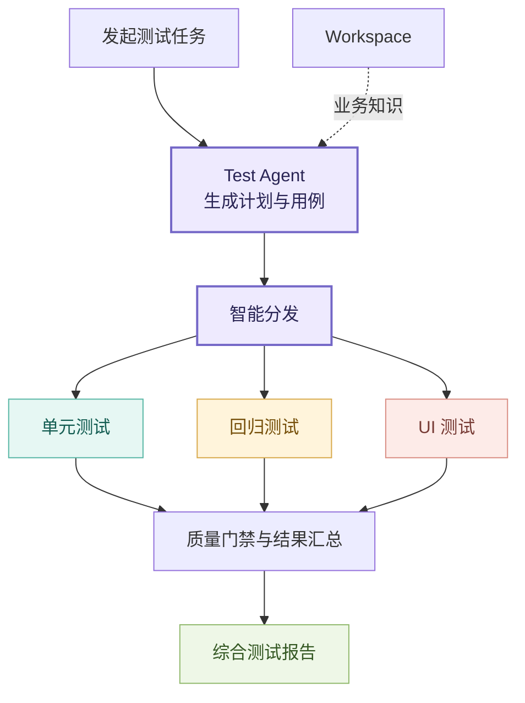
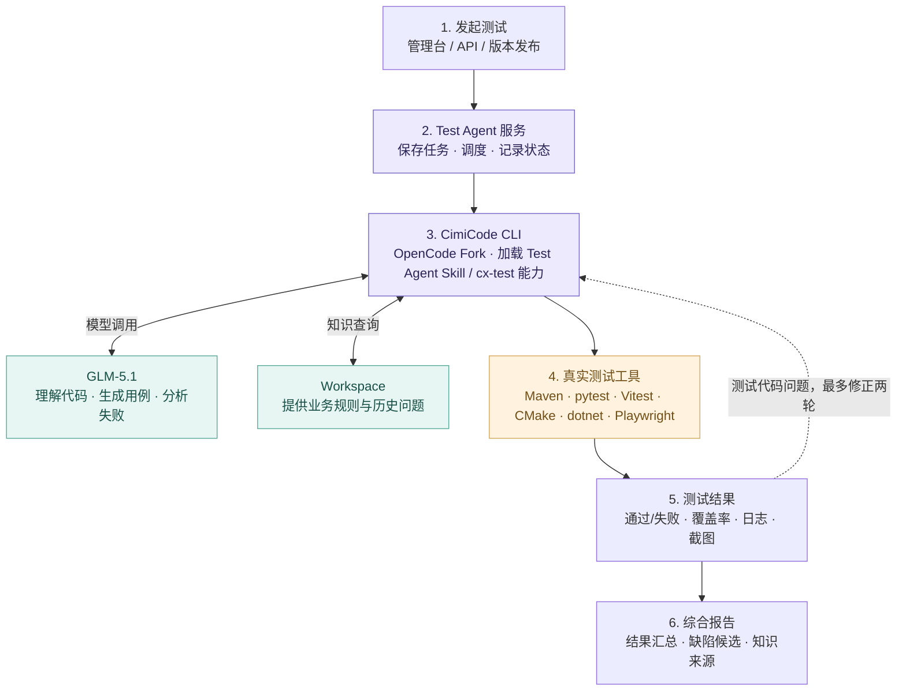
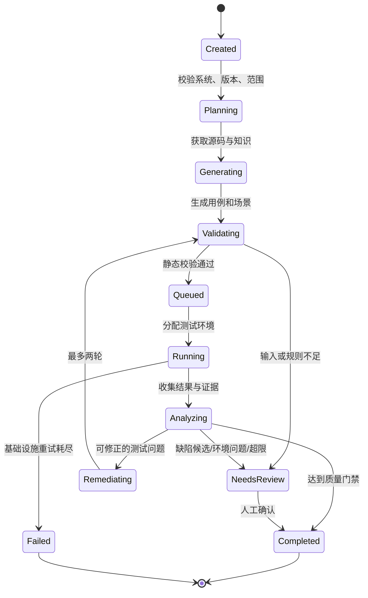
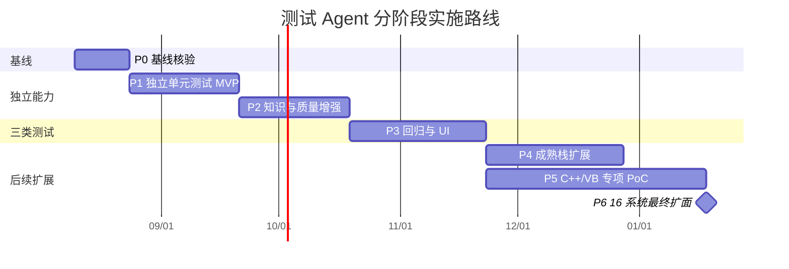

# 测试 Agent 技术方案

> [!summary] 方案结论
> 建设一个可独立部署和运行的测试 Agent。它对外提供统一任务入口，对内以 QA Pipeline 编排单元测试、回归测试和纯 UI 测试，并连接 Workspace 知识库、多技术栈执行环境及报告中心。现有 cx-test 作为测试生成与执行内核的复用候选，不直接等同于最终产品。

## 目标与范围

### 建设目标

面向 CIMDEV + YMS 16 个核心系统，建设一套独立于编码 Agent 和开发者 IDE 的测试 Agent，实现：

- 自动理解系统、版本变更和测试范围；
- 读取 Workspace 中的业务规则、状态流转和历史问题；
- 自动生成并执行单元测试、回归测试和纯 UI 测试；
- 适配 Java、Python、TypeScript/Vue、C++、VB.NET 等技术栈；
- 对失败进行分类，并对测试代码问题进行有限自动修正；
- 输出包含用例、执行结果、覆盖率、截图和知识来源的标准化报告；
- 支持人工、API、CI/版本事件和定时任务触发；
- 最终覆盖 16 个系统的核心回归场景。

### 已确认的实施优先级

> [!important] 分阶段覆盖策略
> 首期优先使用 Java、Vue/TypeScript 等测试生态成熟的技术栈，先跑通独立 Agent、单元测试、回归测试、UI 测试和综合报告的完整闭环。C++、VB 不从最终范围中删除，但不阻塞首期可用版本；后续通过能力调研和真实系统 PoC，逐步确定可用工具、执行环境和正式覆盖计划。

具体顺序为：

1. **首期主线**：Java + Vue/TypeScript，优先完成一个系统的三类测试闭环；
2. **成熟栈扩展**：根据系统实际情况继续覆盖 Python 等已有成熟测试框架的技术栈；
3. **C++ 专项**：盘点编译器、CMake、测试框架、硬件 SDK 和 Mock 条件，寻找可落地的单元与回归测试能力；
4. **VB 专项**：先确认是 VB.NET 还是 VB6；VB.NET 评估 Windows + MSBuild + MSTest/NUnit，VB6 单独评估 IDE、COM/ActiveX 和可自动化边界；
5. **最终扩面**：只有专项 PoC 通过后，才把相应 C++、VB 系统纳入批量接入和正式验收。

该策略区分两个完成口径：

- **首期可用**：Java、Vue/TypeScript 系统具备完整 Test Agent 闭环；
- **项目最终完成**：16 个系统按各自技术栈完成约定能力接入和验收，包含经 PoC 确认可支持的 C++、VB 范围。

### 产品定位

客户看到的是**一个独立 Test Agent**；内部实现是**任务服务 + CimiCode CLI/GLM-5.1 + QA Pipeline + 多技术栈测试环境**。

最终产品形态更接近一个独立的 QA Pipeline 操作台：用户选择系统、版本和测试范围后，Agent 完成知识查询、计划生成、三类测试分发、执行监控和报告汇总。下图是评审阶段的产品效果示意，不代表界面细节已经定稿。

![[assets/测试 Agent 产品操作台示意.svg]]

后台工作流可简化为：

### 建设范围

| 范围 | 建设内容 | 主要输出 |
|---|---|---|
| 独立 Agent | 任务入口、系统绑定、计划生成、调度、状态管理、人工门禁 | 独立服务、API、最小管理界面 |
| 单元测试 | 源码分析、用例生成、编译执行、断言校验、覆盖率 | 测试代码、结果、覆盖率 |
| 回归测试 | 核心场景库、版本基线、差异选择、自动执行 | 回归报告、通过/失败统计 |
| UI 测试 | Web/客户端场景、页面操作、状态断言、截图取证 | UI 报告、步骤证据、截图 |
| 多技术栈 | 首期 Java、Vue/TypeScript；成熟后扩展 Python；C++、VB 通过专项 PoC 逐步接入 | 测试环境、工具配置、结果转换脚本、专项评估报告 |
| 知识联动 | Workspace 查询、来源记录、冲突与降级处理 | 业务上下文、知识引用 |
| 报告治理 | 结果归一、缺陷候选、制品归档、跨系统统计 | 标准报告、看板数据、审计日志 |

### 非目标

- 不自动修改或合并生产代码；
- 不以 Agent 推断替代业务人员确认的规则和回归基线；
- 不承诺第一次生成即可覆盖全部业务场景；
- 不把 UI 自动化等同于完整人工探索性测试；
- 不在基线验证前承诺旧版 cx-test 已满足 80% 指标；
- 不要求所有技术栈使用同一种容器或执行环境。

## 实施方案

### 总体架构

公司当前使用的是 **CimiCode CLI**，它是基于 OpenCode 的 Fork 版本，并已接入 **GLM-5.1**。因此 Test Agent 不需要再建设一套新的大模型运行框架，而是在服务器上以非交互方式调用 CimiCode CLI，通过 Test Agent Skill/Command 完成分析和编排，再调用真实测试工具执行。

这张图可以用一句话理解：

> **CimiCode CLI + GLM-5.1 负责“想和生成”，Maven、pytest、Playwright 等工具负责“真正执行和证明”。Test Agent 服务负责把全过程串起来。**

| 组件 | 用通俗语言解释 | 是否使用 AI |
|---|---|---|
| Test Agent 服务 | 接任务、排队、调用 CimiCode CLI、保存状态、汇总报告 | 自身主要是确定性程序 |
| CimiCode CLI | 基于 OpenCode Fork 的 Agent 运行入口，加载 Skill、读取源码、调用模型和工具 | 是，连接 GLM-5.1 |
| GLM-5.1 | 理解需求和代码、生成用例、补充断言、分析失败 | 是 |
| Workspace | 向模型提供系统业务规则、状态流转和历史缺陷 | 作为知识来源 |
| 真实测试工具 | 编译并运行测试，产生客观结果 | 否 |
| 测试机器/容器 | 安装编译器、运行时、浏览器和被测依赖 | 否 |
| 报告中心 | 保存结果、覆盖率、日志、截图和知识来源 | 否 |

### 独立 Test Agent 服务

“独立”不是指抛弃 CimiCode CLI，而是指**不再要求开发人员在本机 IDE 中手工输入 `/cx-test`**。建议在测试服务器上部署 Test Agent 服务，由服务为每个任务启动一个隔离的 CimiCode CLI 进程，自动加载 Test Agent Skill，并使用公司已配置的 GLM-5.1。

Test Agent 服务负责：

- 接收人工、API、版本发布和定时任务；
- 为任务准备源码、配置、临时工作目录和测试环境；
- 调用 CimiCode CLI，并传入系统、版本、范围和测试类型；
- 记录 CimiCode CLI、模型调用和测试工具的运行状态；
- 对超时、重试、人工确认和报告归档进行统一管理。

CimiCode 是公司 Fork，不能直接假定它与上游 OpenCode 的命令参数、非交互模式和扩展机制完全一致。CimiCode CLI 的非交互调用、退出码、流式日志、进程隔离、并发能力和 Skill/Command 注册方式，需要在 P0 使用公司实际版本核验；当前方案不预设未经验证的命令格式。

首期提供两类入口：

- **OpenAPI**：供 CI、版本发布系统和后续插件集成；
- **最小管理界面**：用于人工发起、查看进度、审批异常和下载报告。

任务状态统一为：

### 三类测试能力

| 能力 | 输入 | 处理过程 | 输出 |
|---|---|---|---|
| 单元测试 | 源码、变更范围、依赖、业务规则 | 结构分析、生成测试、语法校验、编译执行、断言有效性检查、覆盖率采集 | 测试代码、结果、覆盖率、有效性说明 |
| 回归测试 | 版本差异、核心场景、环境、历史基线 | 选择受影响场景、准备数据、执行链路、与基线比较 | 场景报告、通过/失败、差异、缺陷候选 |
| UI 测试 | 页面入口、账号角色、交互步骤、预期状态 | 浏览器或客户端操作、元素和状态断言、关键节点取证 | 步骤结果、截图、日志、失败定位 |

### cx-test 复用策略

已核验的旧版 cx-test 具备技术栈识别、测试类型选择、结构化生成、执行、结果解析、覆盖率、报告及 Playwright 截图等候选能力，但其 TestGenerator 主要是确定性模板和代码结构生成，不能直接证明断言具有业务语义。

| 能力 | 策略 |
|---|---|
| 技术栈检测、框架映射 | 优先复用或抽取 |
| 源码/设计解析、测试骨架 | 通过 PoC 判断复用质量 |
| 执行、结果解析、覆盖率 | 优先作为测试工具适配器基础 |
| Playwright 与截图 | 作为 Web UI 能力候选内核 |
| IDE 命令和当前项目上下文 | 不作为独立 Agent 入口 |
| Workspace 查询、业务语义断言 | 新增 |
| 独立调度、跨系统管理、统一报告 | 新增 |

实施原则为“**先包装验证，再决定抽取或重构**”。P0/P1 先通过适配层接入最新版 cx-test 并测量真实基线，不预设复用比例，也不提前决定重写。

### Workspace 知识联动

Test Agent 根据类名、接口、模块、变更范围等信息向 Workspace 查询业务规则、状态流转和历史缺陷，将带来源和版本的知识片段加入测试上下文。

- Workspace 凭证只提供给 Test Agent/CimiCode CLI，测试工具和测试机器不直接查询知识库；
- 报告记录断言使用的知识来源和版本；
- Workspace 不可用时按策略降级，并在报告中披露；
- 知识、源码和回归基线冲突时不自动裁决，转人工确认；
- 代码逻辑只说明当前实现，不自动等同于正确业务预期。

### 多技术栈执行环境

- **执行环境**就是实际跑编译器、测试框架和浏览器的机器或容器，不是另一个 Agent；
- 首期优先建设 Java 的 JDK + Maven/Gradle + JUnit 环境，以及 Vue/TypeScript 的 Node.js + Vitest/Jest + Playwright 环境；
- Python 可在成熟栈扩展阶段使用 Python + pytest 接入；
- C++ 候选环境为项目指定编译器 + CMake + GoogleTest/Catch2，但必须结合真实项目依赖验证；
- VB.NET 候选环境为 Windows + .NET/MSBuild + MSTest/NUnit；VB6 不能套用 VB.NET 方案，需单独调研；
- Web UI 使用安装 Playwright 和浏览器的测试环境；桌面 UI 是否纳入本期须客户确认；
- Java、Python、TypeScript/Vue 和可容器化的 C++ 优先使用 Linux 容器；
- VB.NET、依赖 Windows 组件的 C++ 和桌面客户端使用 Windows 测试节点；
- 每次任务使用隔离工作区，源码原则上只读，测试生成物写入临时目录；
- 每种测试工具通过适配脚本把结果转换成统一格式，返回覆盖率、日志和截图；
- 任务具有超时、资源限制、网络白名单和清理策略。

### 失败处理与报告

失败至少分为测试代码问题、产品缺陷候选、执行环境问题、测试数据问题和需求/知识冲突。只有测试代码问题允许自动修正，最多两轮，禁止通过修改业务预期让测试“变绿”。

标准报告包含：

- 系统、版本、范围和触发方式；
- 测试计划及实际执行清单；
- 单元测试代码、编译/执行结果和覆盖率；
- 回归场景结果及基线差异；
- UI 测试步骤、关键截图和失败截图；
- 失败分类、修正过程和最终状态；
- 知识来源及降级说明；
- 未覆盖项、需人工确认项和原始制品链接。

### 安全与权限

- 源码使用项目级只读凭证，生成代码首期只形成候选变更，不自动合并；
- 测试执行环境默认不能访问生产环境，仅放通授权测试目标；
- 测试账号和密钥临时注入，不写入提示词、日志和报告；
- 报告、截图和代码片段按系统权限隔离；
- Test Agent 服务记录触发人、知识查询、模型调用、重试和人工确认；
- 模型输入执行敏感信息过滤和项目边界校验。

## 实施周期

### 周期估算

采用“成熟技术栈主线交付 + C++/VB 专项探索”的双路线。建议先用 **15 周左右**完成 Java + Vue/TypeScript 首期可用版本；后续成熟栈扩展和 C++/VB 专项根据真实系统条件继续推进。由于 C++、VB 环境尚未盘点，当前不为 16 系统最终全覆盖给出虚假固定工期。

| 阶段 | 周期 | 主要工作 | 阶段交付 |
|---|---:|---|---|
| P0 基线核验 | 2 周 | 核验最新版 cx-test；选试点；建立验证集；盘点环境和接口 | 基线报告、复用边界、详细计划 |
| P1 独立单元测试 MVP | 4 周 | OpenAPI、最小管理界面、任务状态机、CimiCode CLI 服务化调用、Java 测试环境、cx-test 适配、基础报告 | 脱离 IDE 的单元测试闭环 |
| P2 知识与质量增强 | 4 周 | Workspace 查询、知识引用、业务断言、失败分类、两轮修正 | 试点有效占比和差距报告 |
| P3 回归与 UI | 5 周 | 场景库、版本基线、测试数据、Playwright 测试环境、截图、综合报告 | Java + Vue/TypeScript 首期可用版本 |
| P4 成熟栈扩展 | 4—6 周 | 扩展 Python 等成熟技术栈；分批接入具备条件的系统 | 成熟技术栈系统覆盖清单 |
| P5 C++/VB 专项 PoC | 每类 4—8 周，按条件并行 | 选一个真实系统，完成环境盘点、工具选型、生成与执行基线 | C++/VB 可行性、效果数据和后续估算 |
| P6 16 系统最终扩面 | P5 后评估 | 按系统准入条件分批接入、核心场景导入和抽检验收 | 16 系统覆盖与验收报告 |

### 周期调整条件

出现以下情况时，应在 P0 后重新评估周期：

- 最新 cx-test 与旧版结构或能力差异较大；
- 试点单元测试有效占比低于 60%，需要重构生成内核；
- 需要覆盖 VB/C++ 桌面 UI，而非仅 Web UI；
- 16 个系统无法提供可重复构建环境或稳定测试环境；
- Workspace 接口、知识来源或版本协议尚未确定；
- 需要新建跨系统测试数据平台或 Windows 测试节点集群。

15 周是 Java + Vue/TypeScript 首期可用版本的估算，不包含未经验证的 C++、VB 批量接入承诺。P0 确认首期排期；P5 每完成一类技术栈 PoC，再确认该类系统的规模接入工期。

## 验证标准

### 总体验收矩阵

| 类别 | 验证标准 | 证据 |
|---|---|---|
| 独立 Agent | 不打开 IDE、不依赖编码 Agent，可通过 API/管理界面完成任务 | 任务记录、运行日志、演示录像或现场验收 |
| 单元测试 | 有效用例占比 ≥ 80%，并分别披露编译、执行和断言指标 | 测试代码、执行报告、人工抽检记录 |
| 回归测试 | 16 系统核心场景已登记、可触发、结果可追溯 | 场景清单、版本报告、失败证据 |
| UI 测试 | 指定核心流程可自动操作，报告包含步骤和截图 | UI 报告、截图、日志 |
| 首期技术栈 | Java、Vue/TypeScript 具有可重复运行的测试环境和真实系统验证 | 环境清单、版本、任务记录 |
| C++/VB 专项 | 分别产出真实项目 PoC；明确支持范围、有效占比、环境约束和不可自动化部分 | PoC 报告、执行证据、后续估算 |
| 知识联动 | 知识来源可追溯；不可用时能降级并披露 | 报告知识字段、降级记录、对照实验 |
| 报告完整度 | 用例、结果、覆盖率、截图、缺陷候选、未覆盖项齐全 | 标准报告抽检 |
| 稳定性 | 相同版本和环境重复执行结果可解释，无无界重试 | 重复运行记录、失败分类、资源指标 |
| 安全性 | 权限隔离、密钥不落盘、不访问生产、操作可审计 | 配置核验、安全测试、审计日志 |

### 单元测试有效性口径

为避免只看单一总数，分别统计：

- **编译通过率** = 编译通过用例数 / 已生成用例数；
- **执行完成率** = 获得确定执行结果用例数 / 编译通过用例数；
- **断言有效率** = 能验证明确预期行为的用例数 / 执行完成用例数；
- **有效用例占比** = 同时满足可编译、可执行、断言有效的用例数 / 已生成用例数。

断言有效性按被测契约判断，不能仅凭 API 名称机械判定。例如 `assertNotNull` 在“返回值必须存在”是明确契约时可以有效；若只用于让用例通过且不能区分正确与错误实现，则无效。

### 验证集

试点验证集至少覆盖：

- 简单函数和工具类；
- 具有依赖和 Mock 的服务类；
- 具有状态流转和业务规则的核心类；
- 异常、边界和权限场景；
- 可复现的历史缺陷；
- 核心 API/服务回归场景；
- 典型 UI 业务流程。

验证集由系统架构师、开发和测试共同确认，不能只选择易生成样本。首期验收以 Java、Vue/TypeScript 为范围。C++、VB 在专项 PoC 前不承诺达到 80%；PoC 后必须向客户披露真实结果，由客户决定保持目标、增加投入、缩小可自动化范围或调整验收口径。

### 阶段门禁

| 阶段 | 退出标准 |
|---|---|
| P0 | 最新源码、试点系统、验证集、环境和真实基线均已确认 |
| P1 | 不依赖 IDE 完成 Java 单元测试生成、执行和报告闭环 |
| P2 | 知识来源可追溯；有效占比达到目标或形成可量化差距和决策材料 |
| P3 | 一个试点系统完成单元、回归、UI 三类测试闭环 |
| P4 | Python 等成熟技术栈至少在一个真实项目中完成重复验证 |
| P5 | C++、VB 分别形成真实系统 PoC、能力边界和后续决策材料 |
| P6 | 16 系统核心场景按确认范围可调度、结果可追溯、报告通过抽检 |

## 风险与 Need Help

### 主要风险

| 风险 | 影响 | 应对措施 |
|---|---|---|
| 代码实现被误当成正确业务规则 | 生成与缺陷一致的错误断言 | 使用 Workspace、历史缺陷和人工确认基线；冲突转人工 |
| 断言形式正确但没有判断力 | 测试通过却发现不了缺陷 | 人工抽检、历史缺陷回放、必要时引入变异测试抽样 |
| cx-test 最新版能力未知 | 错估复用比例和工期 | P0 核验最新版并建立真实基线 |
| 多技术栈环境差异 | 大量假失败，难以复现 | 环境版本化、执行前预检、依赖锁定、Windows/Linux 分池 |
| C++/VB.NET 或桌面 UI 复杂 | 容器化和自动化成本显著增加 | 提前盘点真实系统；明确桌面 UI 是否在范围内 |
| UI 用例脆弱 | 选择器或数据变化导致频繁失败 | 稳定测试标识、显式等待、测试数据准备与回收 |
| 自动修正掩盖产品缺陷 | 修改预期让错误实现通过 | 仅修正测试代码问题，修正次数受限并完整留痕 |
| Workspace 内容过期或冲突 | 错误业务知识进入断言 | 强制来源和版本；冲突不自动裁决 |
| 16 系统同时接入失控 | 环境、负责人、场景准备不足 | 一个系统跑通后分批复制，设置系统准入清单 |
| 测试数据和账号不足 | 回归与 UI 无法稳定运行 | 建立测试账号、数据准备、重置和隔离机制 |

### Need Help：客户侧需提供

| 事项 | 需要的支持 | 最晚时间 | 不提供的影响 |
|---|---|---|---|
| 试点系统 | 指定一个可稳定构建、业务清晰、具备 API 和 Web UI 的系统 | P0 第 1 周 | 无法建立基线和确定复用策略 |
| 系统 Owner | 每个系统指定架构、开发、测试和业务联系人 | 系统接入前 | 业务规则和失败结论无法确认 |
| 源码与构建 | 仓库只读权限、构建说明、依赖源、测试命令 | P0 | 自动测试环境无法落地 |
| 测试环境 | 稳定环境、访问白名单、服务依赖和版本说明 | P0/P3 前 | 回归和 UI 测试无法验证 |
| 测试账号与数据 | 不同角色账号、数据准备和重置机制 | P3 前 | UI 和业务回归不稳定 |
| Workspace 接口 | 正式认证、查询、来源、版本、限流和错误协议 | P2 前 | 无法实施知识增强与来源追踪 |
| 核心回归场景 | 16 系统核心场景清单、预期结果、优先级和 Owner | P3/P5 前 | 无法证明“覆盖核心场景” |
| C++/VB 试点与执行资源 | 各提供一个真实项目；提供编译器、依赖、Windows 节点、许可和技术负责人 | P5 前 | 无法开展专项 PoC，也无法承诺最终覆盖 |
| 安全规则 | 源码、日志、截图、模型输入和制品留存要求 | P1 前 | 架构和部署无法定版 |
| 验收人员 | 明确 80% 指标抽样方法、样本量和签字人 | P0 退出前 | 达标结论可能产生争议 |

### Need Help：评审会需决策

1. 是否接受“一个独立 Test Agent，内部采用 QA Pipeline”的产品定位；
2. 首期入口是否采用 OpenAPI + 最小管理界面；
3. 首个试点系统及验证集负责人；
4. cx-test 是否按“先包装验证、后决定抽取或重构”执行；
5. 首期 UI 测试按 Web 范围实施；VB/C++ 桌面客户端是否在专项 PoC 后纳入；
6. 生成测试代码是否允许形成仓库候选变更，审批和合并由谁负责；
7. 16 系统核心回归场景的 Owner 和完成时间；
8. C++、VB 的真实系统、语言版本、执行环境及 Windows 节点来源；
9. 首期 80% 指标按 Java、Vue/TypeScript 分别抽样；C++、VB 在 PoC 后再决定正式口径；
10. 是否接受“首期约 15 周，C++/VB 和 16 系统最终扩面在专项 PoC 后估算”的周期策略。

> [!warning] 当前未验证边界
> 最新 cx-test、Workspace 正式接口、16 系统构建环境、C++/VB 语言版本与测试条件、桌面 UI 范围和验收抽样方法尚未核验。本方案因此保持 `draft`；评审接受的结论应另行沉淀为 `accepted` 决策，不因本稿形成而自动生效。
