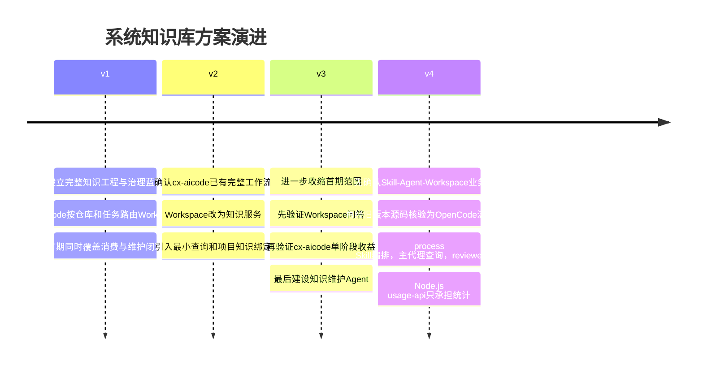

# CIMDEV AI 编程 II 期系统知识库方案版本演进记录

## 1. 记录目的

本记录说明系统知识库方案从第一版到第四版的职责边界、实施范围和验证顺序变化。第一版和第二版原文件当时未单独保存，现有历史笔记根据对话内容重建，因此是语义级历史记录，不是字节级快照；第三版是在升级第四版前保存的方案快照摘要。

当前有效方案为 [[../01 需求与决策/CIMDEV AI 编程 II 期系统知识库可执行方案|系统知识库可执行方案 v4]]。用户已于2026-07-30确认第四版业务逻辑和实施顺序，状态为 `accepted`；Workspace真实API、最新版cx-aicode差异、代码实现和验收仍未完成。

## 2. 版本时间线

## 3. 四版对比

|维度|v1|v2|v3|v4 当前草案|
|---|---|---|---|---|
|cx-aicode定位|任务入口和路由者|既有AI编程工作流主控|既有流程主控，先接一个阶段|OpenCode工程流程插件|
|实际执行者|未明确区分|cx-aicode后端|cx-aicode Python后端|process Skill编排，OpenCode主代理执行，reviewer只读判断|
|Workspace定位|知识平台兼部分任务编排|正式知识服务|通用问答服务|正式知识源，由Agent工具调用|
|统计后台定位|触发与集成后端|知识适配层|WorkspaceKnowledgeClient承载者|Node.js usage-api只做统计；不代理知识查询|
|调用载荷|任务、仓库、分支、文件、用户上下文|system、stage、query|项目静态绑定加具体问题|system_id、stage、query；源码仅在明确必要且授权时传递|
|试点范围|消费与维护全链路|完整PoC|单系统、单APP、单阶段|一个项目、一套知识库、需求到交付完整流程|
|知识维护Agent|首期核心组成|较早建设|价值证明后建设|与在线消费Agent严格分离，仍后置建设|
|首期接入方式|后端或插件调用|Python适配层|Python客户端|OpenCode主代理调用Workspace工具/APP，Node.js桥接仅作备选|
|推广前闸门|单系统技术闭环|完整技术闭环|有无知识效果对照|Skill不被破坏、Agent调用可降级、效果对照通过|
|排期原则|约30至32周估算|保留长周期估算|阶段2和3后重估|拿到Skill和后台源码后再做源码级估算|

## 4. v1 到 v2 的变化原因

用户补充：cx-aicode已经包含需求分析、设计、代码生成、Code Review和测试操作。由此确认第一版把cx-aicode描述得过于像任务转发插件。

第二版据此作出以下修正：

- cx-aicode继续掌控已有AI编程流程；
- Workspace只提供正式系统知识；
- 仓库、分支、文件和会话不再作为统一必传载荷；
- 项目和知识库关系通过稳定绑定维护；
- cx-aicode仅发送系统、阶段和具体知识问题；
- 知识维护Agent不参与普通编码请求编排。

## 5. v2 到 v3 的变化原因

进一步评审发现，第二版虽然职责正确，但仍把完整知识治理平台、五阶段接入和知识自动维护放得过早，造成Workspace、cx-aicode和知识维护Agent之间关系再次变得模糊。

第三版采用验证驱动顺序：

1. 一个系统、一套专家确认知识、一个知识库；
2. 一个通用Workspace问答APP；
3. 先验证问答、引用、拒答、版本隔离和权限；
4. 只在cx-aicode一个既有阶段增加知识查询；
5. 用同一任务做有无Workspace对照；
6. 有收益后扩展需求分析和测试；
7. 再决定设计和代码生成；
8. 最后建设版本差异、审批、发布和回滚Agent；
9. 经3个代表系统测算后推广到16个系统。

## 6. v3 到 v4 的变化原因

用户先确认cx-aicode以Skill和Markdown约束为核心，随后提供旧版本源码。源码进一步表明它是完整OpenCode工程流程插件，包含commands、process skills、只读reviewer agents、hooks、Node.js原子脚本和独立usage-api。第三版把Python后台视为知识适配和流程承载者，因此组件边界不准确。

第四版据此修正为：

1. cx-aicode process Skill定义需求、设计、编码、Review和测试的工作方法，以及各阶段何时查询知识；
2. OpenCode主代理负责执行Skill、调用工具、组合当前任务上下文和Workspace返回结果；
3. Workspace继续作为正式知识源和RAG服务，不接管cx-aicode工作流；
4. 只读reviewer不直接联网，Workspace知识由主流程显式注入；
5. Node.js usage-api首期可完全不改，确需运营观测时只追加最小记录字段；
6. Workspace接入优先使用OpenCode工具或已发布APP，独立Node.js桥接仅在能力缺口出现时建设；
7. 保留v3的单系统、单知识库、单APP和对照实验，但不保留单阶段交付；工程可分步开发，业务必须全流程验收。

用户随后进一步确认：业务流程不分首期，只按系统范围分批。第四版因此采用“一个项目先行、完整流程交付”的边界，需求分析、方案设计、任务拆解与实现、Code Review、测试验证和交付收尾均属于第一个项目试点范围。

## 7. 当前稳定边界与未决事项

### 已形成共识的方向

- cx-aicode process Skill负责规定做事方法，OpenCode主代理负责执行，Workspace负责提供正式企业知识。
- Workspace不接管cx-aicode既有工作流。
- Node.js usage-api不是知识代理，也不是Agent运行时。
- 首期不发送完整仓库、分支、文件、源码和会话历史。
- 在线知识查询与离线知识维护是两条独立链路。
- 知识自动维护在知识消费价值验证之后建设。
- 当前内容是 `draft` 方案，不是已实施事实。

### 尚待验证

- Workspace问答是否能够稳定返回来源和适用版本；
- OpenCode是否能直接绑定Workspace原生知识工具或已发布APP；
- 最新版cx-aicode与已核验旧版本的差异；
- usage-api现有记录模型是否需要追加知识使用字段；
- 旧知识是否可以可靠退出默认检索；
- 一个通用APP能否满足首期多个问题类型；
- cx-aicode最适合作为首个试点的是Code Review、需求分析还是测试；
- 知识增强是否在真实任务中带来可量化收益；
- 原始Chunk接口是否确有必要；
- 版本更新、审批、发布和回滚的最终实现边界。

## 8. 后续版本管理规则

- 当前执行方案继续保留在 `01 需求与决策`，文件名不随小修订变化。
- 会改变职责边界、实施顺序、验收门槛或公共接口的重大修订，应先创建当前版本历史快照，再更新主方案。
- 历史版本使用 `status: deprecated`，并通过 `superseded_by` 指向现行方案。
- 历史重建内容必须标注 `reconstruction: conversation-derived`，不得宣称为原始文件快照。
- 正式接受某一版时另行记录 `accepted` 决策；只有实施和验收证据可以标记为 `verified`。
