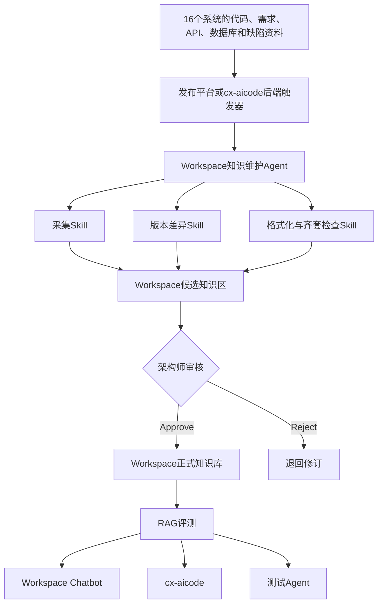

# 系统知识库可执行方案 v1

> [!warning] 历史重建说明
> 本文依据对话中首次方案的内容和结构重建，不是当时文件的字节级快照。它用于保留方案演进证据，已被当前第三版方案替代，不作为现行执行依据。

## 1. 第一版定位

第一版将客户需求定义为：基于现有私有化 Workspace，为 CIMDEV 与 YMS 的 16 个核心系统建设标准化、可追溯、带版本并适合 RAG 检索的知识资产；通过 Skill、Agent、Python Sandbox 和开放 API 建立知识采集、格式转换、齐套检查、版本差异生成、人工审核、正式发布和持续评测闭环；通过 cx-aicode Python 后端按代码仓库和任务类型检索系统知识，为需求分析、方案设计、代码生成、Code Review、排障和测试生成提供上下文。

总体判断是技术方向可行，但需先验证 Workspace 的知识替换与下线、引用返回、发布触发、审批状态机和大型仓库处理能力。

## 2. Workspace 能力判断

第一版根据客户材料确认 Workspace 支持：

- Access Token、用户 GUID、项目成员和权限；
- 文件夹、笔记、Markdown、标签、属性和模板；
- 笔记内容读取、版本保存和历史更新记录；
- 附件上传、Word/PPT 转 PDF 和 Excel 预解析；
- 知识库目录、文件上传和属性管理；
- 指定知识库进行流式 AI 问答；
- Scope、Top-K、Score、Context 和 Prompt 工作流；
- APP运行、日志和结果查询；
- Agent、Skill、Sandbox、消息、待办和告警。

第一版将以下事项列为 PoC：

- 知识库文件替换、删除和归档；
- 旧知识退出 RAG 索引；
- Chunk、Score、来源和版本返回；
- Git、CI/CD 或发布平台触发；
- 架构师 Approve/Reject；
- Sandbox访问Git和运行资源边界。

## 3. 第一版总体架构



第一版建议“Workspace项目负责知识生产和协作、Workspace知识库负责正式发布和检索”。

## 4. 知识模型

第一版已经提出三层复用：

|层级|内容|
|---|---|
|组织级|安全、日志、通用API、版本和Review规则|
|技术栈级|Java、C++、Python、VB、TypeScript、Vue3编码与测试规范|
|系统级|业务、术语、架构、流程、API、数据库、错误和技术债务|

同时指出原规划实际为14类内容、10类必须项和4类非必须项，不能机械执行“16 × 14”，按语言建设的规范应复用。

建议状态包括：`candidate`、`reviewing`、`effective`、`deprecated`、`historical` 和 `rejected`。只有 `effective` 进入默认检索。

## 5. 知识维护能力

第一版规划的 Skill 包括：

- 资料盘点；
- 知识采集；
- 知识格式化；
- 齐套检查；
- 版本差异分析；
- 冲突与过期检查；
- 审核辅助；
- 检索评测。

知识维护 Agent 状态机为：

```text
created
→ collecting
→ generating
→ validating
→ reviewing
→ approved / rejected
→ publishing
→ indexing
→ evaluating
→ completed / failed
```

版本上线后，Agent获取代码、接口、数据库和文档差异，生成候选知识，经架构师审核后发布并运行回归评测。

## 6. 第一版 cx-aicode 设计

第一版将 cx-aicode 设计为根据仓库、模块、版本和任务类型检索知识，并设置仓库到系统、知识库和多个 APP 的映射。

```yaml
repositories:
  cim-order-service:
    system_id: order
    knowledge_base_id: kb-id
    qa_app_id: qa-app-id
    coding_context_app_id: coding-app-id
    review_app_id: review-app-id
```

第一版调用链路中，插件向 Python 后端发送任务、仓库、分支、文件和用户上下文；后端识别系统、模块、版本和任务类型，再调用 Workspace，并将知识与代码上下文一起交给编码模型。

这一设计后来被认为不准确：cx-aicode本身已经拥有完整的需求、设计、编码、Review和测试工作流，不应为了Workspace重复提交全部上下文，也不应让Workspace重新承担任务路由。

## 7. 第一版实施路线

第一版路线为：

1. 立项澄清与16系统基线盘点；
2. 单系统端到端准入PoC；
3. 标准、模板和工具产品化；
4. 3个代表系统试点；
5. 第一批5个系统推广；
6. 剩余8个系统推广；
7. 运营和L3验收。

第一版曾建议约30至32周的总体方案估算，并要求PoC同时验证写入、更新、旧知识下线、索引、引用、审批、版本增量、回滚、cx-aicode和异常处理。

## 8. 第一版价值与问题

### 保留下来的价值

- 正确区分了Workspace现有平台能力和项目需要新增的知识工程能力。
- 建立了三层知识模型、状态、版本、审核和评测思想。
- 明确旧知识不能继续污染默认检索。
- 提出了单系统PoC、3系统试点和分批推广。

### 被替代的问题

- cx-aicode调用模型过重，把任务、仓库、分支、文件和用户上下文视为统一载荷。
- cx-aicode与Workspace职责边界不够清楚。
- 在线知识查询和离线知识维护被放在同一首期闭环中。
- 首期同时建设多个APP、Agent、Skill、适配层和全套治理，验证范围过大。
- 在尚未证明知识对cx-aicode有价值前就给出较长整体排期。

后续修订见 [[系统知识库可执行方案 v2]] 和 [[方案版本演进记录]]。
