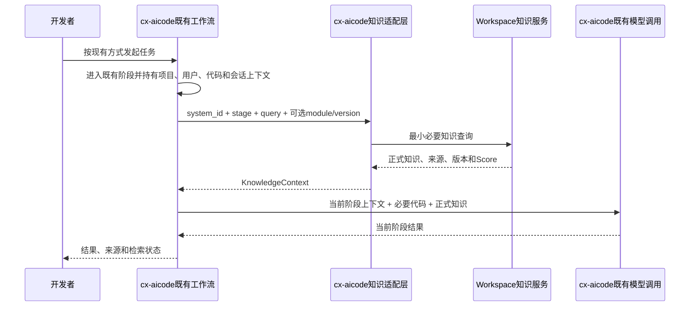

# 系统知识库可执行方案 v2

> [!warning] 历史重建说明
> 本文依据对话中的第二版修订内容重建，不是当时文件的字节级快照。它用于保留职责边界修正的历史证据，已被当前第三版方案替代。

## 1. 第二版核心修正

第二版确认 cx-aicode 已经具备需求分析、方案设计、代码生成、Code Review 和测试等完整工作流，因此重新定义关系：

```text
cx-aicode = AI编程流程主控
Workspace = 正式系统知识服务
知识适配层 = 二者之间的最小化接口
知识维护Agent = 生产和更新正式知识
```

Workspace不负责决定cx-aicode下一阶段，也不接管需求、设计、编码、Review或测试。

## 2. 第二版职责划分

|组件|职责|不承担|
|---|---|---|
|cx-aicode现有工作流|需求、设计、编码、Review、测试和阶段推进|不把流程控制交给Workspace|
|cx-aicode知识适配层|系统绑定、查询构造、Workspace调用、结果裁剪、引用和降级|不生成或审核正式知识|
|Workspace知识检索|按Scope召回正式知识|不读取整个仓库，不决定cx-aicode阶段|
|知识维护Agent|采集、差异、候选、审核和发布|不参与普通编码请求编排|
|发布平台或集成服务|触发版本知识更新|不承担日常知识查询|

## 3. 项目知识绑定

第二版将仓库信息从“每次调用载荷”调整为“项目初始化或管理配置时的稳定绑定”：

```yaml
project_knowledge_bindings:
  cim-order-service:
    system_id: order
    workspace_project_guid: project-guid
    knowledge_base_id: kb-id
    knowledge_profile: java-backend
    default_version: current
```

绑定完成后，cx-aicode工作阶段直接使用系统和知识库标识，不重复向Workspace发送仓库详情。多个仓库可以绑定同一系统，并以模块或知识Profile区分知识范围。

## 4. 最小查询契约

第二版提出统一接口：

```python
get_system_knowledge(
    system_id: str,
    stage: str,
    query: str,
    module: str | None = None,
    applicable_version: str | None = None,
    top_k: int | None = None,
) -> KnowledgeContext
```

必需参数只有：

- `system_id`：限定系统；
- `stage`：当前cx-aicode阶段；
- `query`：具体知识问题。

不再作为统一必传项：

- 完整仓库信息；
- Git分支；
- 文件列表；
- 完整源码或Diff；
- 用户全部上下文；
- 全量会话历史。

用户身份从cx-aicode登录态继承用于权限检查。分支仅在确实影响知识版本时转换为 `applicable_version`。文件和Diff继续由cx-aicode处理，只提取知识概念形成查询。

## 5. 第二版调用链路



## 6. 阶段内知识使用

|阶段|主要查询知识|Workspace不承担|
|---|---|---|
|需求分析|背景、术语、业务规则、流程和状态机|需求拆解和范围决策|
|方案设计|架构、模块边界、API、数据库和技术债务|方案权衡|
|代码生成|编码规范、典型代码、接口和数据规则|源码读取和编辑|
|Code Review|Review、安全、常见错误和系统特例|Diff分析和问题定级|
|测试|业务规则、状态机、验收条件和历史缺陷|用例生成和执行|

推荐阶段开始时少量预取，执行过程中按需查询，避免一次加载所有知识。

## 7. 两阶段技术接入

第一阶段通过统一适配层调用Workspace发布的问答APP，封装认证、轮询、超时、限流和结果格式。第二阶段争取独立检索接口，使cx-aicode获得Chunk、Score、来源、版本和笔记标识，避免将Workspace生成的自然语言答案再次作为编码模型的二手上下文。

第二版同时定义了：

- `hit`、`no_hit`、`unavailable` 和 `forbidden` 等状态；
- Token刷新和限流退避；
- 最小权限和凭证注入；
- 正式知识缓存及发布后失效；
- 系统、阶段、版本、耗时、命中和引用观测；
- 知识错误反馈进入治理待办，不由cx-aicode直接修改正式知识。

## 8. 第二版实施路线

第二版仍沿用较完整的平台化实施顺序：

1. 立项澄清和基线盘点；
2. 单系统端到端准入PoC；
3. 标准、模板、Skill、API适配和评测工具产品化；
4. 3个代表系统试点；
5. 5个系统推广；
6. 剩余8个系统推广；
7. 运营和L3验收。

虽然第二版修正了cx-aicode调用关系，但仍要求首期PoC同时覆盖知识写入、更新、旧知识下线、索引、引用、审批、版本增量、回滚、cx-aicode和异常处理，并保留了约30至32周的整体方案估算。

## 9. 第二版价值与问题

### 保留下来的价值

- 明确cx-aicode是工作流主控，Workspace是知识服务。
- 取消完整仓库、分支、文件和会话的统一传输。
- 将仓库关系收敛为项目知识绑定。
- 定义最小查询接口、返回结构、降级和安全边界。
- 区分知识维护Agent和日常知识消费。

### 被第三版继续修正的问题

- 首期仍同时验证知识消费、知识维护、审核、发布和回滚，范围过重。
- 在尚未证明Workspace知识能改善cx-aicode前，就产品化复杂适配、缓存和多阶段能力。
- 原始Chunk接口和多场景配置被赋予较高优先级。
- 3系统试点前缺少“单阶段有无知识对照”的明确价值闸门。
- 仍提前给出长周期整体估算。

第三版将路线收缩为：先Workspace问答，再cx-aicode单阶段对照，随后扩展阶段，最后建设知识维护Agent。详见 [[../01 需求与决策/CIMDEV AI 编程 II 期系统知识库可执行方案]] 和 [[方案版本演进记录]]。
