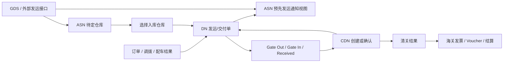

# CDN、DN、ASN 业务含义

## 一句话结论

在 DCS 物流域里，`DN` 是车辆发运/交付的主单据，`ASN` 是预先发运通知及到货计划视图，`CDN` 是清关/报关单据。三者围绕同一批 VIN 的物流链路协作：先有订单/配车/发运形成 DN，ASN 承载外部 GDS 发运信息和待定仓库处理，CDN 记录车辆清关结果并可回写到 DN 信息上。

## 缩写含义

| 缩写 | 英文含义 | 系统内业务含义 | 主要作用 |
| --- | --- | --- | --- |
| DN | Delivery Note / Vehicle Delivery Note | 发运通知单、交付通知单 | 按 VIN 记录车辆从起点组织/仓库发往目标组织/仓库/客户的物流单据。承载订单、调拨、承运商、运输方式、ETA/ETD/ATA/ATD、Gate In/Gate Out/Received 等物流节点。 |
| ASN | Advance Shipping Notice | 预先发运通知、到货计划 | 系统里大量 ASN 列表基于 DN + GDS 发运信息展示。用于提前知道车辆何时发出、何时到港/到仓、船名航次、提单、港口、外部发运单等信息；同时有 ASN 待定仓库池，用于外部发运信息还不能确定入库仓库时，由业务后续选择仓库。 |
| CDN | Customs Declaration Note | 清关/报关单 | 按 VIN 或批次记录车辆清关信息，包括清关日期、仓库、报关行/供应商、海关口岸、Pediment、预估进口关税等。用于判断车辆是否已清关，以及支撑后续海关发票、凭证、结算等财务动作。 |

## DN：发运/交付主单据

`DN` 是物流域最核心的车辆移动单据。它把 VIN、订单、调拨、发运起点、目的地、承运信息和物流时间节点串起来。

典型业务场景：

- 订单 DN：基于 Trade Order / Vehicle Order 创建，表示车辆面向客户或销售组织的发运。
- 调拨 DN：基于 Transfer Order 创建，表示组织/仓库之间的车辆调拨。
- Gate Out：车辆从起点发出。
- Gate In：车辆到达目标仓库并入库。
- Received：客户或下游完成收车确认。
- Cancelled：发运单取消。

关键状态：

```text
DeliveryNoteStatusEnum
CREATED   = 1
CANCELLED = 2

DNShowStatusEnum
CREATED   = 1
CANCELLED = 2
GATEIN    = 3
GATEOUT   = 4
RECEIVED  = 5
```

主要数据表：

```text
lm_delivery_note       # DN 主表：delivery_note_no、VIN、订单/调拨、起止组织/仓库、运输方式、承运商、ETA/ETD/ATA/ATD 等
lm_delivery_note_info  # DN 展示/过程信息：dn_status、gate_in/out、received、at port、custom release、cdn_no/cdn_item_no 等
lm_delivery_note_gds_info # GDS 发运信息：invoice/document、船名航次、港口、提单、SAP outbound delivery、销售价、HS code 等
```

关键代码入口：

```text
dcs-global-vehicle/dcs-service/src/main/java/com/smil/globalvehicle/logistics/domain/entity/VehicleDeliveryNote.java
dcs-global-vehicle/dcs-service/src/main/java/com/smil/globalvehicle/logistics/infrastructure/dao/DeliveryNoteDao.java
dcs-global-vehicle/dcs-service/src/main/java/com/smil/globalvehicle/logistics/infrastructure/dao/DeliveryNoteInfoDao.java
dcs-global-vehicle/dcs-service/src/main/java/com/smil/globalvehicle/logistics/domain/valueobject/enums/DeliveryNoteTypeEnum.java
dcs-global-vehicle/dcs-service/src/main/java/com/smil/globalvehicle/logistics/domain/valueobject/enums/DeliveryNoteStatusEnum.java
dcs-global-vehicle/dcs-service/src/main/java/com/smil/globalvehicle/logistics/domain/valueobject/enums/DNShowStatusEnum.java
dcs-global-vehicle/dcs-service/src/main/resources/mappers/lm/DeliveryNoteDaoMapper.xml
```

## ASN：预先发运通知和到货计划

`ASN` 在当前系统里有两层含义。

第一层是查询/展示意义上的 ASN。很多接口叫 `asnPagelist`、`asnNo`，但底层并没有完全独立的 ASN 主表，而是从 `lm_delivery_note`、`lm_delivery_note_info`、`lm_delivery_note_gds_info` 等表组合出 ASN 视图。这里的 `asnNo` 往往就是 `delivery_note_no`。

第二层是 `ASN Warehouse Pending`。当 GDS 或外部发运接口推送了一批车辆，但系统暂时不能确定具体入库仓库时，会进入待定仓库池。业务后续选择仓库后，系统会保存 DN/交付信息并继续跟踪物流。

典型业务场景：

- 查看发运预告：按 ASN/DN、VIN、仓库、船名、港口、ETA/ATA/ATD 等条件查询。
- 客户 ASN 列表：给客户侧展示船名航次、提单、港口、物料描述、预计/实际到达时间等。
- ASN 上传：维护或导入车辆发运信息。
- ASN 待定仓库：外部单据已来，但入库仓库未确定；业务选择仓库后继续生成/更新交付信息。
- 物流公司/第三方跟踪：后续可被 SCH/KAR/FBI/Buffalo 等第三方对接或 tracking 流程使用。

关键状态：

```text
WarehousePendingStatusEnum
PENDING   = 1  # 待指定仓库
SPECIFIED = 2  # 已指定仓库
```

主要数据表：

```text
lm_delivery_note
lm_delivery_note_info
lm_delivery_note_gds_info
lm_asn_warehouse_pending
lm_asn_warehouse_pending_item
```

关键代码入口：

```text
dcs-global-vehicle/dcs-service/src/main/java/com/smil/globalvehicle/logistics/domain/entity/GdsAsnInfo.java
dcs-global-vehicle/dcs-service/src/main/java/com/smil/globalvehicle/logistics/domain/entity/ASNWarehousePending.java
dcs-global-vehicle/dcs-service/src/main/java/com/smil/globalvehicle/logistics/application/service/AsnWarehousePendingService.java
dcs-global-vehicle/dcs-service/src/main/java/com/smil/globalvehicle/logistics/application/service/PickAsnWarehousePendingService.java
dcs-global-vehicle/dcs-service/src/main/java/com/smil/globalvehicle/logistics/application/service/DeliveryNoteQueryService.java
dcs-global-vehicle/dcs-service/src/main/java/com/smil/globalvehicle/logistics/infrastructure/adapter/service/LmGDSDeliveryService.java
dcs-global-vehicle/dcs-service/src/main/resources/mappers/lm/DeliveryNoteDaoMapper.xml
dcs-global-vehicle/dcs-service/src/main/resources/mappers/lm/DeliveryNoteGdsInfoDaoMapper.xml
dcs-global-vehicle/dcs-service/src/main/resources/mappers/lm/AsnWarehousePendingMapper.xml
```

## CDN：清关/报关单

`CDN` 是 Customs Declaration Note。它不是车辆发运单，而是车辆清关/报关结果的记录。业务上关注的是这台车或这一批车是否需要清关、是否已经清关、清关日期是什么、归属哪个仓库/组织、预估进口关税是否已维护。

典型业务场景：

- 手工创建 CDN：可从 Purchase Invoice、VIN、DN 列表等入口创建。
- 自动创建 CDN：根据仓库、组织、VIN 和系统规则自动生成，部分场景会直接进入 Confirm。
- CDN Confirm：确认清关信息，写入清关日期、海关/报关行、预估进口关税等。
- Gate In 触发：部分入库场景会根据保税/非保税仓、`need_cdn` 标志自动创建或确认 CDN。
- 删除/取消确认：Created 才能删除，Confirm 后可走取消确认逻辑。
- 后续财务：清关数据会被海关发票、凭证推送、结算等使用。

关键状态：

```text
CdnStatusEnum
CREATED = 1
CONFIRM = 2

CdnGenerationTypeEnum
MANUAL    = 1
AUTOMATIC = 2

NeedCdn
Y = 1  # 仓库需要报关单
N = 0  # 仓库不需要报关单
```

主要数据表：

```text
lm_customs_declaration_note      # CDN 主数据：cdn_no、cdn_item_no、VIN、clear_date、warehouse、vendor、customs_office、pediment、tariff 等
lm_customs_declaration_note_info # CDN 明细/扩展信息
lm_delivery_note_info            # 可保存 cdn_no、cdn_item_no，用于 DN 与 CDN 关联
```

关键代码入口：

```text
dcs-global-vehicle/dcs-service/src/main/java/com/smil/globalvehicle/logistics/application/service/CdnApplicationService.java
dcs-global-vehicle/dcs-service/src/main/java/com/smil/globalvehicle/logistics/infrastructure/dao/CustomsDeclarationNoteDao.java
dcs-global-vehicle/dcs-service/src/main/java/com/smil/globalvehicle/logistics/domain/valueobject/enums/CdnStatusEnum.java
dcs-global-vehicle/dcs-service/src/main/java/com/smil/globalvehicle/logistics/domain/valueobject/enums/CdnGenerationTypeEnum.java
dcs-global-vehicle/dcs-service/src/main/java/com/smil/globalvehicle/masterdata/domain/valueobject/NeedCdn.java
dcs-global-vehicle/dcs-service/src/main/java/com/smil/globalvehicle/logistics/userinterface/restful/LmCdnController.java
dcs-global-vehicle/dcs-service/src/main/java/com/smil/globalvehicle/logistics/userinterface/representation/LmCdnQueryController.java
```

## 三者关系



关系说明：

- DN 是车辆物流移动的主线单据，记录 VIN 从哪里发出、到哪里去、当前到哪个物流节点。
- ASN 是发运预告和运输计划，当前系统里多数 ASN 查询依赖 DN 和 GDS 发运信息；ASN 待定仓库用于处理“单据来了但仓库未定”的入库前置问题。
- CDN 是清关单据，和 DN 不是同一种单据。CDN 关注清关和进口税费，DN 关注运输和交付过程。
- DN 信息表中可以挂 `cdn_no`、`cdn_item_no`，表示某个 DN/VIN 已关联对应清关记录。
- Gate In、仓库类型、仓库 `NeedCdn` 标志会影响 CDN 是否需要创建、确认或校验。

## 排查时怎么区分

| 问题现象 | 优先看哪个 |
| --- | --- |
| 查不到发运单、车辆不能 Gate Out/Gate In、客户不能收车 | DN |
| ASN 页面查不到、船名航次/港口/提单/ETA/ATA 不对 | ASN / GDS 发运信息 |
| 外部发运单已来但仓库没确定，车辆在待处理池 | ASN Warehouse Pending |
| 入库时提示清关/CDN 问题，或需要确认清关日期 | CDN |
| 海关发票、报关行、预估进口关税、清关凭证问题 | CDN |
| 同一 VIN 的物流状态链路不连续 | 先看 DN，再看 ASN/GDS 信息和 CDN 关联 |

## 注意点

- 代码里的 `asnNo` 不一定来自独立 ASN 表，很多地方实际对应 `delivery_note_no`。
- `lm_delivery_note_gds_info.invoice_no` 在部分业务里也会被叫作 document no / 外部单据号，和 DCS 内部 DN 编号不是一回事。
- CDN 的 `CONFIRM` 不等于 DN 的 `Gate In` 或 `Received`，它表达的是清关确认。
- 仓库主数据里的 `need_cdn` 会影响是否必须维护 CDN 和预估进口关税。
- global 与 smmx 的物流包结构相似，排查时一般先看 global，再对照 smmx 同名类和 mapper。

## 相关排查记录

- [[../../../05 历史与复盘/对话排查记录/2026-07-13 MX Warehouse Pending 发运后无数据排查|MX Warehouse Pending 发运后无数据排查]]
- [[../../../05 历史与复盘/对话排查记录/2026-07-13 MX 创建 DN 报 REPUVE 为空排查|MX 创建 DN 报 REPUVE 为空排查]]


