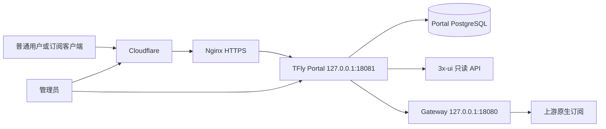

# 2026-08-02 TFly Portal 第一版实施与生产发布验收记录

> [!summary] 阶段结论
> TFly Portal 第一版已完成核心账号、真实邮件、服务绑定、流量与时长展示、Portal 订阅 Token、独立管理员控制台和公网统一入口。源码自动化测试与 PostgreSQL 集成验收通过；生产入口健康检查已通过 Cloudflare、Nginx 和 Portal 返回 `HTTP/2 200`。真实用户浏览器流程、真实流量值以及客户端更新订阅仍需发布后人工验收，不能仅凭健康检查标记为通过。

## 已接受并实施的产品边界

- Portal 是面向普通用户的唯一公开产品入口，公开域名同时承载登录、用户中心和 Portal 鉴权后的订阅地址。
- 第一版不展示套餐、支付、本地演示或上游面板名称，先提供账号、服务状态、流量、有效期和订阅能力。
- 继续采用 Go 服务端渲染；HTML、CSS 和少量 JavaScript 静态资源嵌入 Portal 二进制，不单独部署前端。
- `portal/` 与 `gateway/` 保持同一代码工作区、两个独立 Go module 和两个独立进程。Gateway 仅作为 Portal 的回环上游继续运行。
- 普通用户页面与管理员页面使用不同路由和页面结构。管理员登录后进入 `/admin`，普通用户进入 `/`。
- 用户不接触上游管理地址、API Token、原生订阅 ID 或服务账号标识。

## 第一版实现范围

### 账号与邮件

- 支持注册、登录、退出、邮箱验证、重新发送验证邮件、找回密码和密码重置。
- SMTP 已接入真实邮件服务；此前验证邮件已实际送达。
- 密码、会话、操作 Token、CSRF、防暴力尝试、管理员二次认证和审计逻辑由 Portal 服务端处理。

### 用户中心

- 展示服务状态、已用流量、剩余流量、总流量、剩余时长、到期日期和最近在线时间。
- 上游数据不可用或找不到绑定时显示明确状态，不把未知值伪装成零流量。
- 服务数据优先调用官方按客户标识查询接口 `/panel/api/inbounds/getClientTraffics/:email`，并保留 `/panel/api/inbounds/list` 作为旧版兼容回退。

### 订阅

- 管理员将 Portal 用户绑定到服务账号标识和上游订阅标识。
- 用户自行生成 Portal 订阅 Token；数据库只保存摘要和短前缀，完整地址只在生成或轮换时显示一次。
- 用户轮换 Token 后旧地址立即失效。
- 公开 `/clash/{portal-token}` 先验证 Token、账号与绑定，再由 Portal 请求回环 Gateway；浏览器和客户端不会获得原始订阅标识。
- 生成页面增加复制地址和测试订阅入口。

### 独立管理员控制台

- 新增 `/admin` 管理概览，展示客户总数、正常账号数、已绑定服务数和有效会话数。
- `/admin/users` 提供用户检索、账号启停、强制下线和绑定维护。
- 管理员控制台有独立导航和布局，并保留“查看用户端”入口。

## 架构与运行链路

- Nginx 不再把公开 `/clash/` 直接交给 Gateway，而是将整个 HTTPS 站点转发给 Portal。
- Gateway 继续监听回环地址，不直接暴露给普通用户。
- Portal 和 Gateway 的进程、环境文件及 systemd 服务保持分离，便于独立回滚。

## 验收证据

### 源码与构建

- `go test ./portal/... ./gateway/...`：通过。
- `go vet ./portal/... ./gateway/...`：通过；由于仓库 Git 元数据异常，构建时显式关闭 VCS stamping，此问题不影响源码测试结果。
- `go test -tags integration ./portal/internal/portal`：通过。该验收使用临时 PostgreSQL，覆盖注册、验证、登录、管理员二次认证、独立后台、用户绑定、状态展示、订阅生成与轮换、Gateway 代理、账号停用和会话撤销。
- Linux amd64 发布二进制已生成，发布时记录的 SHA-256 为 `F488D798688C59390C6C478C29358DA38EB6F91C55390DD84F30CBBD1B6C2D2E`。

### 生产运行

- Portal systemd 服务曾在服务器本机显示 `active (running)`，并监听 `127.0.0.1:18081`。
- 本机 `GET /healthz` 返回 `HTTP 200` 和 `ok`。
- Nginx 站点由原先的 `/clash/ -> Gateway` 与根路径 `404`，调整为整个站点代理 Portal。
- Nginx 备份最初保留在 `sites-enabled`，导致备份文件也被加载并出现 `duplicate listen options`；将备份移到非加载目录后消除该原因。
- 公网 `https://sub.tfly.org/healthz` 已经通过 Cloudflare 返回 `HTTP/2 200` 和 `ok`，响应包含 Portal 安全头，证明 Cloudflare、Nginx 到 Portal 的公开健康链路已连通。

## 配置与安全边界

- 生产环境使用公开 URL 和订阅基础 URL `https://sub.tfly.org`，Secure Cookie 开启。
- Portal 与 Gateway 继续仅监听本机回环地址；公网只开放 Nginx HTTP/HTTPS。
- 生产环境文件保留数据库、SMTP、面板访问凭据等敏感值；发布时不得用示例配置整体覆盖。
- Vault 不记录真实数据库连接、SMTP Key、面板 Token、私网地址、订阅 ID、完整订阅地址或用户个人数据。
- Nginx 可加载目录中不得存放站点备份；备份应放入不被 `nginx.conf` include 的受控目录。

## 回滚点

- Portal 新二进制替换前保留 `/opt/tfly-portal/tfly-portal.previous`。
- Portal 环境文件修改前保留时间戳备份。
- Nginx 站点修改前保留备份，但备份必须移出 `sites-enabled`。
- Portal 发布失败时停止服务、恢复 previous 二进制并重新启动；Nginx 只在 `nginx -t` 成功后重载。

## 尚未验证

- [ ] 使用生产域名完成一次普通用户注册、收信、验证、登录和找回密码闭环。
- [ ] 使用真实绑定账号确认已用流量、剩余流量、剩余时长、到期日期和最近在线值正确。
- [ ] 使用管理员账号确认登录后进入独立 `/admin`，并完成用户检索和绑定维护。
- [ ] 新生成订阅地址确认为 `https://sub.tfly.org/clash/...`，且不再包含 localhost。
- [ ] 在 Clash/Mihomo 等真实客户端更新 Portal 订阅并确认节点、策略组、流量响应头和轮换失效行为。
- [ ] 验证旧的直接 Gateway 公网路径不能绕过 Portal Token。

## 后续优先级

1. 完成上述生产人工验收，并保留不包含凭据的状态码与页面结果。
2. 为服务数据同步增加管理员可见的错误分类与观测指标，避免仅依赖服务器日志。
3. 根据真实用户数量评估自动开通、批量绑定和多节点聚合，不在第一版提前引入支付。
4. 在稳定观察期后决定是否把 Gateway 转换逻辑并入 Portal；当前不应因“同一产品”而强行合并运行边界。

## 关联记录

- [[TFly Portal项目索引]]
- [[2026-07-31 Portal 统一入口与订阅整合需求汇总]]
- [[2026-07-31 TFly Portal 项目重命名实施记录]]
- [[2026-07-31 3x-ui 私有管理面收口与订阅故障复盘]]

