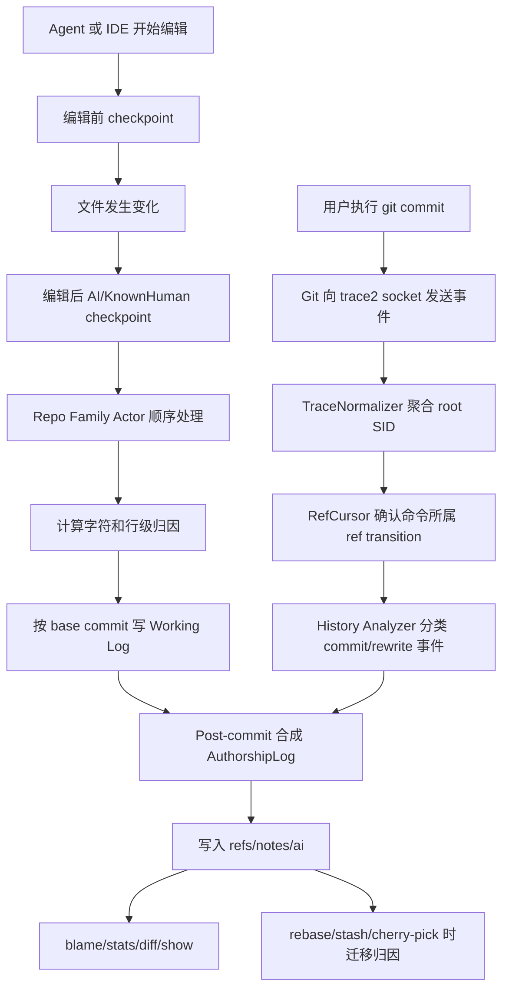

# git-ai 项目架构、业务流程与使用指南

> [!summary] 结论
> git-ai 不根据代码风格“检测” AI，而是记录 Agent 编辑时的 checkpoint 证据，再将行级归因转换为绑定 commit 的 Git Note。Git 命令通过 trace2 异步进入 daemon，归因在 rebase、amend、stash、cherry-pick 等操作中按不可变 Git 对象迁移。

## 本次沉淀范围与证据

本笔记总结 2026-07-27 对源码仓库的分析，对应 commit `e9e6bbd218c1f35405dedfd20e17b19fb4acb65e`，包含：

- README、Cargo、Taskfile、安装脚本和 CLI 入口的原始文件核验。
- checkpoint、working log、post-commit、trace2 daemon、ref cursor 和 rewrite 的源码与权威规格核验。
- `TestRepo` 集成测试框架与重写操作测试范围核验。
- 复用 Vault 外 Graphify 代码图谱辅助定位模块和调用链；所有重要结论已回到原始源码或规格核验。

## 项目解决的问题

传统 Git 可以说明 commit 由谁提交、哪个 commit 修改了某行，但不能回答：

- 某行是人、AI Agent 还是未明确跟踪的工具产生。
- AI 代码对应哪个 Agent、模型和会话。
- Agent 生成多少代码，有多少最终被接受或被人改写。
- Git 历史被重写后，新 commit 应继承哪些旧归因。

git-ai 通过显式 checkpoint 和 Git 不可变对象回答这些问题。它允许出现归因缺口，但禁止在缺乏证据时猜测归因。

## 核心概念

### Checkpoint 类型

| 类型 | 语义 |
|---|---|
| `Human` | 历史名称，当前表示 untracked/未明确识别的修改，不是确认的人工归因 |
| `KnownHuman` | IDE 或扩展明确识别的人工编辑 |
| `AiAgent` | Agent 明确产生的修改 |
| `AiTab` | IDE AI 补全类修改 |

Agent 的典型流程是：编辑前用 `human` checkpoint 隔离既有修改，编辑后用具体 Agent preset 记录本次 AI 差异。

### Working Log

checkpoint 中间结果按 base commit 写入：

```text
.git/ai/working_logs/<base_commit>/
```

它保存文件内容哈希、字符/行级归因、Agent 身份、时间、trace ID 和行数统计，表示“相对于某个 HEAD，当前未提交内容由谁产生”。

### Authorship Log 与 Git Note

提交后，working log 与 commit tree 中真正提交的内容合成 `authorship/3.0.0` AuthorshipLog，写入：

```text
refs/notes/ai
```

Note 保存文件到行范围的 attestation，并关联 Agent、模型、session、known-human 和必要的 prompt 元数据。完整会话数据不应直接塞入 Git 仓库。

## 系统架构

| 子系统 | 职责 | 主要路径 |
|---|---|---|
| CLI 与二进制分发 | 区分 `git-ai` 命令与 Git 透明转发模式 | `src/main.rs`、`src/commands/` |
| Checkpoint 系统 | 解析 Agent hook payload，构建文件快照和行级归因 | `src/commands/checkpoint_agent/`、`src/daemon/checkpoint.rs` |
| Daemon 和 trace2 摄入 | 异步接收 Git 事件、checkpoint、会话和遥测 | `src/daemon.rs`、`src/daemon/` |
| 归因引擎 | 维护 attribution，生成 working log/AuthorshipLog | `src/authorship/` |
| Git 存储和批处理 | 读写 notes、refs、objects 和 working logs | `src/git/` |
| Agent/session 适配 | 增量读取 Claude、Codex、Cursor、Copilot 等会话 | `src/streams/agents/` |
| IDE 集成 | 捕获 known-human 编辑、展示 AI blame | `agent-support/vscode/`、`agent-support/visualstudio/` |

## 端到端业务流程



### Checkpoint 处理

1. Agent preset 解析 hook payload，取得文件、Agent ID、model、session/trace 元数据。
2. 定位仓库和当前 base commit，读取已有 checkpoints。
3. 以 checkpoint 时的持久化文件快照与上次 checkpoint/Git 内容比较。
4. Attribution tracker 更新行归因，追加到 `checkpoints.jsonl`。
5. 异步处理时禁止事后重读 live worktree 并假设它仍是 checkpoint 时的内容。

### Git trace2 命令归属

trace2 只能说明某条 Git 命令执行过，不总是直接给出它创建的 commit SHA。daemon 因此必须证明 ref transition 属于哪条命令。

精确归属至少需要：

1. 命令前已有可信 reflog cursor；或
2. argv 携带足够的不可变完整 OID。

如果都不存在，daemon 必须 fail closed：不猜 HEAD、不用时间戳或 commit message 当所有权证明，只为下一条命令建立基线。

### Post-commit 处理

1. 取得精确的提交前 base commit 和新 commit SHA。
2. 读取 working log 和新 commit 的不可变 tree/blob。
3. 区分已提交、未提交、部分暂存、AI、KnownHuman 和 untracked 内容。
4. 压缩行范围，生成 `authorship/3.0.0` AuthorshipLog。
5. 写入新 commit 的 `refs/notes/ai`，并保留仍未提交的 working attribution。

## Git 历史重写与归因迁移

迁移系统遵守四个原则：

- **证据原则**：只有 checkpoint 或已有 Note + 不可变 Git 对象可以证明归因。
- **守恒原则**：Git tree diff 证明未变的行保留归因；变化 hunk 中的旧归因丢弃。
- **不可变输入原则**：使用 commit/tree/blob/note/持久化快照和精确 ref transition，不使用事后 live worktree。
- **Fail-closed 原则**：不能证明 old/new tip 时不迁移。

核心算法批量读取 notes，用一次批量 `rev-parse` 和一次 `diff-tree --stdin -p -U0 -M -r` 计算 tree pair，将未变区间迁移到新 commit，同时保持 Git 进程数量为 O(1)。

| 操作 | 归因处理 |
|---|---|
| rebase/amend/restack | 建立旧 commit 到新 commit 映射，迁移未变行 |
| cherry-pick | 批量计算 stable patch-id，再配对精确源和新 commit |
| squash merge | 先把多个源 Note 合并到 source-head 坐标，再迁移到 squash commit |
| reset | 根据精确 HEAD 移动迁移或重建 working log |
| stash | 以 stash commit SHA 为稳定身份，不依赖可变的 `stash@{N}` |
| revert | 对实际恢复的旧行恢复其原归因，新冲突内容仍需 checkpoint |
| commit-tree/update-ref | 根据 update-ref 的精确转换支持 Graphite 类 restack |

## Agent 会话与 IDE 集成

`src/streams/agents/` 包含 Claude、Codex、Cursor、Copilot、Gemini、Windsurf、OpenCode、Continue CLI、Amp、Pi、Droid 等适配器。它们定位 Agent 的本地会话源，通过 watermark 增量读取，提取 session/model 元数据并与 checkpoint/trace ID 关联。

VS Code/Visual Studio 扩展还负责：

- 通过编辑器事件记录 `KnownHuman` checkpoint。
- 显示按 Agent/session 着色的 AI blame。
- 在 hover 中展示可用的 prompt/session 上下文。

## 安装与日常使用

### 正常安装

macOS、Linux、WSL：

```bash
curl -sSL https://usegitai.com/install.sh | bash
```

Windows PowerShell：

```powershell
powershell -NoProfile -ExecutionPolicy Bypass -Command "irm https://usegitai.com/install.ps1 | iex"
```

安装器负责二进制、PATH、Git trace2 target、daemon 和 Agent/IDE 集成。普通使用者不需逐仓库安装 Git hook。

### 常用命令

```bash
# 查看归因状态
git ai status

# AI 版 blame
git ai blame src/main.rs

# 当前或指定范围统计
git ai stats
git ai stats <start_sha>..<end_sha> --json

# 带归因的差异
git ai diff
git ai diff <old>..<new>

# 用原生 Git 查看 Note
git log --show-notes=ai

# daemon 和集成诊断
git ai daemon status
git ai debug
git ai install-hooks --dry-run
```

支持的 Agent 会自动调用 checkpoint，普通用户仍按原流程执行 `git add` 和 `git commit`。

### 手工测试 Checkpoint

```bash
git-ai checkpoint human path/to/file
git-ai checkpoint mock_ai path/to/file
git-ai checkpoint mock_known_human path/to/file
```

`mock_ai` 和 `mock_known_human` 用于测试，不是最终用户需要手工维护的常规流程。

## 配置与存储

- 默认配置文件：`~/.git-ai/config.json`。
- 配置优先级：环境变量 > 配置文件 > 代码默认值。
- Feature flag 使用 `GIT_AI_*` 环境变量。
- 默认 Notes backend 是本地 Git Notes，可选 HTTP notes backend。
- Working attribution 位于 `.git/ai/working_logs/`，commit attribution 位于 `refs/notes/ai`。
- Prompt/session 扫描需遵循本地存储和敏感数据脱敏边界。

## 开发、构建与测试

项目使用 Rust 2024 edition，`Cargo.toml` 声明版本 `1.6.16`，仓库规则要求 Rust `1.93.0`。

```bash
# 只检查编译
task build

# 完整测试和筛选测试
task test
task test TEST_FILTER=foo
task test NO_CAPTURE=true

# 格式和 lint
task fmt
task lint
```

实际试用当前分支必须执行：

```bash
task dev
```

`task dev` 会把 debug build 安装到真实 git-ai 位置、同步 Git 入口、重新执行安装并重启 daemon。不能用 `cargo run` 或直接运行 `target/debug/git-ai` 替代完整本地运行验证，因为真实链路依赖 `argv[0]`、PATH/Git 入口、trace2 全局配置、daemon socket 和 Agent hooks。

### 测试体系

`TestRepo` 会创建真实临时 Git 仓库，用真实 Git + 每测试 daemon/trace socket 跑生产式链路，并显式 sync daemon 后断言文件内容和每行 AI/KnownHuman/untracked 归因。

Taskfile 还包含标准、partial staging、destructive operations、squash-heavy、combined workflow 和 marathon attribution fuzzer。

## 关键工程约束

- 所有 Git 集成/处理由 trace2 驱动，处理必须异步。
- daemon 的 trace2 摄入关键路径不能增加 Git spawn、对象查询、ref 检查或额外文件读取。
- 禁止每 commit、每文件、每 object 或每 ref 调用 Git；Git 进程数量必须有常数上界。
- 优先复用已有 helper，实施时严格 TDD，主要使用 `TestRepo` 集成测试。
- 历史重写的首要目标是避免误归因，而不是尽可能填满每个归因缺口。

## 已验证事实

- 项目产品目标、安装方式、常用命令与支持范围已核对 README 和 CLI 分发源码。
- checkpoint 四种类型、working log 中间存储、post-commit 写 Git Note 已核对对应 Rust 数据结构和处理函数。
- trace2 数据链、RefCursor 所有权规则、fail-closed 行为已核对权威规格和源码路径。
- rewrite 的证据/守恒/不可变/fail-closed 原则与批量迁移算法已核对权威规格。
- Graphify code-only 图谱已从 485 个代码文件提取 12,309 个节点、35,185 条边、456 个社区；图谱只用于辅助导航，不作为本笔记的事实来源。
- 本次没有修改 `git-ai` 业务代码，也没有在源码仓库中生成知识报告或 `graphify-out`。

> [!warning] 未验证边界
> 当前 shell 环境中 `rustc`、`cargo` 和 `task` 不可用，因此未执行 `task build`、`task test`、`task lint`、`task fmt` 或 `task dev`。本笔记的 `verified` 表示上述源码、配置和规格事实已经核验，不表示当前 commit 已在本机编译或通过测试，也不表示生产就绪。

## 图谱语料边界

Graphify 本次使用 code-only AST 提取，因此：

- 148 个非代码文件没有进入图谱。
- 65 个未分类文件被跳过。
- 19 个源文件未产生节点。
- 2 个 SQL fixture 因缺少 `tree_sitter_sql` 没有入图。

这些边界不影响已通过 Rust/TypeScript/C# 源码与原始 Markdown 核验的主流程结论，但图谱不能用于证明未入图文件的细节。

## 建议的后续验证

1. 安装或恢复 Rust 1.93+、Cargo 和 go-task 后执行 `task build`。
2. 执行 `task test`，记录当前 commit 的完整测试证据。
3. 如果需要试用当前分支，使用 `task dev`，不直接用 `cargo run`。
4. 若将来对安装脚本、trace2、daemon 或 rewrite 实现做了实质修改，先增量刷新 Vault 外 Graphify 缓存，再回到源码和测试核验本笔记。

## 关联导航

- [[../git-ai 项目索引|git-ai 项目索引]]
- [[../../项目索引|总项目索引]]
